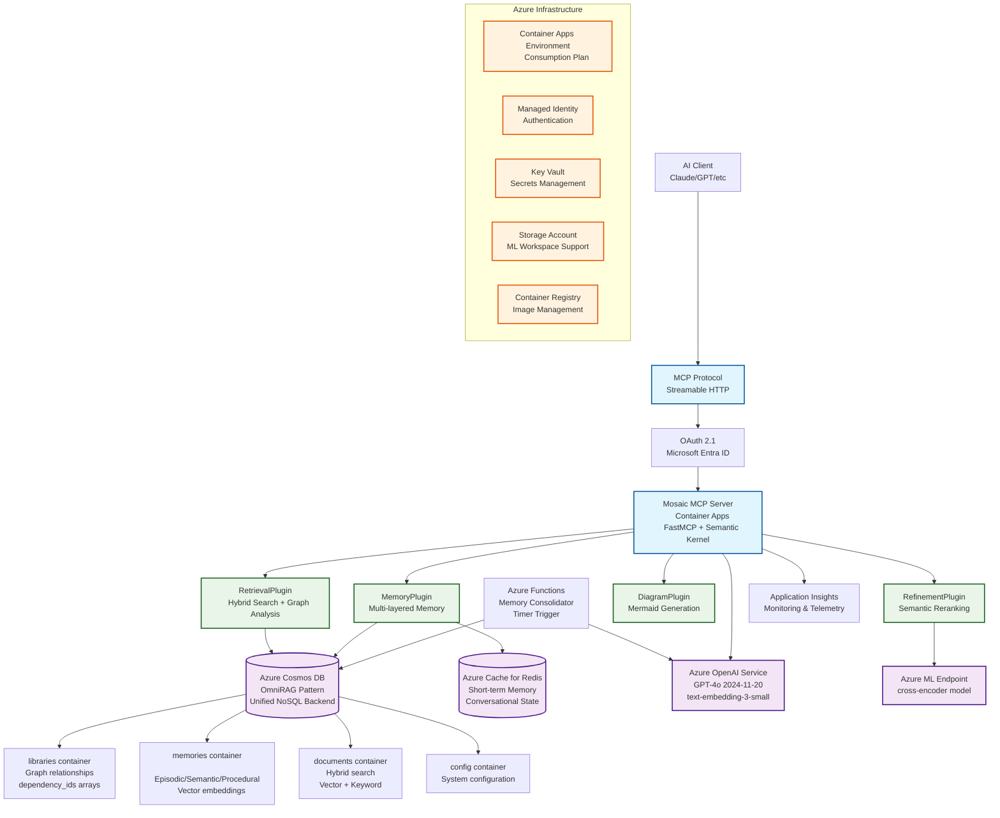
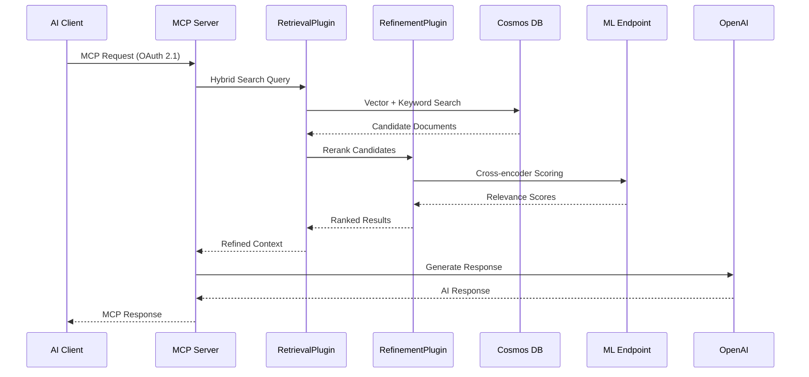

# Mosaic MCP Tool - Architecture Diagram

## System Overview

The Mosaic MCP Tool implements Microsoft's OmniRAG pattern with unified Azure Cosmos DB backend for advanced context engineering and multi-layered memory management.

## Key Architecture Components

### 1. MCP Protocol Layer
- **FastMCP Framework**: Streamable HTTP transport for real-time communication
- **OAuth 2.1 Authentication**: Microsoft Entra ID integration for secure access
- **Standardized Interface**: MCP-compliant tools and resources

### 2. Semantic Kernel Integration
- **Plugin Architecture**: All functionality implemented as SK plugins
- **Modular Design**: Composable and extensible context engineering capabilities
- **Azure Native**: Optimized for Azure services integration

### 3. OmniRAG Pattern Implementation
- **Unified Backend**: Single Azure Cosmos DB for all data operations
- **Embedded Relationships**: Graph data stored as JSON arrays in documents
- **Vector Search**: Native vector indexing for semantic similarity
- **Cost Optimization**: Serverless billing model

### 4. Multi-layered Memory System
- **Short-term Memory**: Redis for conversational state and session data
- **Long-term Memory**: Cosmos DB for persistent knowledge storage
- **Memory Consolidation**: Background Functions for LLM-powered summarization

### 5. Advanced Context Engineering
- **Hybrid Search**: Vector + keyword search for comprehensive retrieval
- **Semantic Reranking**: Cross-encoder model for relevance optimization
- **Graph Analysis**: Dependency and relationship queries
- **Context Refinement**: Addresses "lost in the middle" problem

## Data Flow Architecture

## Container Structure (OmniRAG Pattern)

### libraries Container
- **Partition Key**: `/libtype`
- **Purpose**: Code dependency graph with embedded relationships
- **Schema**: `dependency_ids[]`, `developers[]`, `used_by_lib[]`

### memories Container
- **Partition Key**: `/sessionId`
- **Purpose**: Multi-layered memory storage with vector embeddings
- **Types**: Episodic, Semantic, Procedural memory

### documents Container
- **Partition Key**: `/category`
- **Purpose**: Hybrid search corpus with vector and keyword indexing
- **Features**: Full-text search, semantic similarity

### config Container
- **Partition Key**: `/pk`
- **Purpose**: System configuration and metadata
- **Usage**: Application settings, schema definitions

## Deployment Architecture

### Core Services
- **Container Apps**: Consumption plan for serverless scaling
- **Cosmos DB**: Serverless NoSQL with unified OmniRAG backend
- **Redis Cache**: Basic C0 tier for short-term memory
- **Azure Functions**: Consumption plan for memory consolidation
- **Azure OpenAI**: Latest models (GPT-4o 2024-11-20)

### Security & Identity
- **Managed Identity**: Service-to-service authentication
- **Key Vault**: Secrets and certificate management
- **Microsoft Entra ID**: OAuth 2.1 identity provider
- **RBAC**: Role-based access control for all services

### Monitoring & Operations
- **Application Insights**: Telemetry and performance monitoring
- **Log Analytics**: Centralized logging and analysis
- **Container Registry**: Secure image management
- **Azure CLI**: Infrastructure as Code deployment

## Benefits of This Architecture

1. **Unified Data Layer**: Single Cosmos DB backend reduces complexity and cost
2. **Serverless Optimization**: Pay-per-use pricing for all compute resources
3. **Standards Compliance**: Full MCP protocol implementation
4. **Enterprise Security**: OAuth 2.1 and managed identity authentication
5. **Scalable Design**: Container Apps with automatic scaling
6. **AI-First**: Optimized for modern AI workloads and context engineering

This architecture provides a robust, scalable, and cost-effective foundation for advanced AI context engineering while maintaining strict compliance with MCP protocol standards.