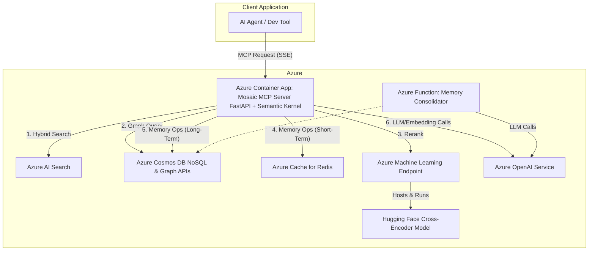

# Technical Design Document: Mosaic MCP Tool v1.0

| Field   | Value       |
|---------|-------------|
| Status  | Final       |
| Version | 1.0         |
| Date    | 2025-07-09  |
| Author  | Chris McKee |

## 1.0 Introduction

### 1.1 Purpose

This document outlines the comprehensive technical architecture and design for the Mosaic Model Context Protocol (MCP) Tool. It serves as the engineering translation of the Product Requirements Document (PRD) v1.3, detailing the implementation plan for building a high-performance, scalable context engine on the Microsoft Azure platform.

### 1.2 Goals of this Document

The primary goal is to provide a detailed engineering blueprint for the development team. This TDD covers the end-to-end design, including system architecture, component-level design, technology stack, data models, API definitions, and operational considerations. It is intended to be the single source of truth for the technical implementation of the Mosaic MCP Tool.

## 2.0 High-Level System Architecture

### 2.1 Architectural Overview

The Mosaic MCP Tool is designed as a cloud-native microservices-based system hosted entirely on Azure. The core of the system is the Mosaic MCP Server, a persistent, containerized process that acts as a centralized context engine for various AI applications and developer tools. This server is built upon the Python Semantic Kernel, which provides a modular, plugin-based architecture for orchestrating AI workflows.

Client applications connect to the server via Server-Sent Events (SSE) to receive context streams. The server, in turn, orchestrates a series of calls to a suite of managed Azure services to fulfill these requests. This architecture ensures scalability, modularity, and high performance by leveraging best-in-class managed services, aligning perfectly with the requirements outlined in the PRD.

### 2.2 System Diagram

The following C4-style diagram illustrates the key system components and their interactions.



## 3.0 Technology Stack

| Component | Technology | Rationale & PRD Requirement(s) |
|-----------|------------|--------------------------------|
| Core Framework | Python Semantic Kernel | Aligns with FR-2; provides a robust plugin architecture for modularity and orchestration. |
| LLM & Embedding Models | Azure OpenAI Service | Provides enterprise-grade, secure, and scalable access to GPT and embedding models. |
| Hosting | Azure Container Apps | Best-in-class for containerized microservices. Superior KEDA-based autoscaling is ideal for handling variable loads of persistent MCP/SSE connections (FR-1, FR-4). |
| Communication | FastAPI with SSE | Modern, high-performance ASGI framework that natively supports Server-Sent Events (FR-3). |
| **Authentication** | **Azure Managed Identity** | **Secure, credential-free authentication across all Azure services. Eliminates connection string management and follows 2025 security best practices.** |
| Hybrid Search | Azure AI Search (Basic tier) | Natively supports vector, keyword, and hybrid search, fulfilling FR-5. Uses managed identity authentication. |
| Graph Database | Azure Cosmos DB (Gremlin API - Serverless) | Managed graph database for codebase dependency analysis (FR-6, FR-4). Uses serverless pricing model with managed identity authentication. |
| Long-Term Memory | Azure Cosmos DB (NoSQL API) | Scalable, schema-flexible NoSQL store for persistent agent memory (FR-10, FR-4). Uses managed identity authentication. |
| Short-Term Memory | Azure Cache for Redis (with Entra ID) | High-speed in-memory cache with Azure AD authentication enabled for secure, managed identity access (FR-10). |
| Memory Consolidation | Azure Functions (Timer Trigger) | Serverless, event-driven compute for running the background memory consolidation task (FR-11). |
| Semantic Reranking | Azure Machine Learning Endpoint | The "AI Foundry" for custom models. Provides a secure, scalable, and fully managed endpoint for hosting the cross-encoder model (FR-8). |
| Developer Tooling | Azure Developer CLI (azd) with AVM | Streamlines provisioning and deployment workflows using Azure Verified Modules for consistency and best practices. |

## 4.0 Detailed Component Design

### 4.1 Core Server Implementation (FR-1, FR-3)

The server will be a Python application using the FastAPI framework. An `/mcp` endpoint will handle SSE connections using a StreamingResponse. A central Kernel instance will be initialized on startup, loading all necessary plugins and AI service connectors.

#### 4.1.1 Hosting Platform: Azure Container Apps

The Mosaic MCP Server will be deployed as a Docker container to Azure Container Apps (ACA). ACA is the superior choice for this workload because its KEDA-based, event-driven scaling is perfectly suited for managing the long-running, variable-load SSE connections inherent to the MCP protocol.

#### 4.1.2 MCP Toolkit & Framework

**Research Finding:** As of July 2025, a standardized, community-accepted Python MCP server toolkit does not exist.

**Implementation Plan:** We will build the MCP server capabilities directly on FastAPI, creating a small set of internal utility classes to handle MCP message formatting and the SSE lifecycle.

#### 4.1.3 Managed Identity Authentication (2025 Security Update)

**Authentication Strategy:** All Azure service connections use Azure Managed Identity with `DefaultAzureCredential` from the Azure Identity SDK. This eliminates the need for connection strings, API keys, and manual credential management.

**Implementation Pattern:**
```python
from azure.identity import DefaultAzureCredential
from semantic_kernel.connectors.ai.azure_openai import AzureChatCompletion

credential = DefaultAzureCredential()
chat_service = AzureChatCompletion(
    deployment_name="gpt-4",
    endpoint=os.getenv("AZURE_OPENAI_ENDPOINT"),
    ad_token_provider=get_bearer_token_provider(
        credential, "https://cognitiveservices.azure.com/.default"
    )
)
```

**Benefits:**
- Zero credential management overhead
- Automatic token rotation and renewal
- Enhanced security with no stored secrets
- Seamless integration with Container Apps system-assigned identity

### 4.2 RetrievalPlugin (FR-5, FR-6, FR-7)

- **HybridSearch (Native Function):** Implemented using the official, built-in AzureAISearchMemoryStore Semantic Kernel connector with managed identity authentication.
- **GraphCode (Native Function):** Uses the standard gremlinpython library to connect to the Cosmos DB Gremlin endpoint with managed identity authentication.
- **AggregateCandidates (Native Function):** A utility function to combine and de-duplicate results.

#### 4.2.1 Serverless Gremlin Configuration (FR-6 Implementation)

**Pricing Model:** Azure Cosmos DB with Gremlin API uses serverless pricing model for cost-effective, consumption-based billing.

**Configuration:** 
- Capabilities: `EnableGremlin` + `EnableServerless`
- No throughput provisioning required (serverless auto-scales)
- Pay only for consumed Request Units (RUs) and storage

**Authentication:** Uses managed identity authentication with proper role assignments for secure, credential-free access to graph operations.

### 4.3 RefinementPlugin (FR-8)

This plugin improves the precision of retrieved context.

#### 4.3.1 Reranking Model

**Model Choice:** We will use the `cross-encoder/ms-marco-MiniLM-L-12-v2` model from Hugging Face. This model provides an excellent balance of high performance on ranking benchmarks and computational efficiency, making it the ideal choice for v1.0.

**Hosting:** The model will be deployed to a dedicated Azure Machine Learning Endpoint. This is the standard, production-grade approach as it provides a scalable, reliable, and secure REST API for the model, isolating its computational needs from the core MCP server.

#### 4.3.2 Implementation

**Rerank (Native Function):** This function is a lightweight wrapper that uses httpx to make a secure API call to the Azure Machine Learning Endpoint.

### 4.4 MemoryPlugin (FR-9, FR-10, FR-11)

**Unified Interface:** A HybridMemory class abstracts all storage logic.

**Storage Logic:**

- **Short-Term:** Uses a standard Semantic Kernel RedisMemoryStore connector.
- **Long-Term:** Uses a custom CosmosDBMemoryStore class inheriting from SK's MemoryStore base class.

**Consolidation Process:** An Azure Function on a timer trigger will use a Kernel configured with the Azure OpenAI connector to summarize conversations and update the long-term store.

### 4.5 DiagramPlugin (FR-12, FR-13)

**GenerateMermaid (Semantic Function):** A Semantic Function with a prompt template processed by a GPT model on Azure OpenAI.

## 5.0 Data Models & Schemas

### 5.1 Cosmos DB Memory Schema (NoSQL API)

```json
{
  "id": "unique_memory_id",
  "sessionId": "user_or_agent_session_id",
  "type": "episodic | semantic | procedural",
  "content": "The user confirmed that the 'auth-service' should be written in Go.",
  "embedding": [0.012, "...", -0.045],
  "importanceScore": 0.85,
  "timestamp": "2025-07-09T12:05:00Z",
  "metadata": {
    "source": "conversation_summary",
    "tool_id": "mosaic.memory.save",
    "conversation_turn": 5
  }
}
```

### 5.2 Graph Database Node/Edge Schema (Gremlin API)

**Node Types:** File, Function, Class, Variable, Module

**Edge Types:** IMPORTS, CALLS, INHERITS_FROM, CONTAINS

## 6.0 MCP Interface Definition

| Function Signature | Description |
|-------------------|-------------|
| `mosaic.retrieval.hybrid_search(query: str) -> List[Document]` | Performs parallel vector and keyword search. |
| `mosaic.retrieval.query_code_graph(gremlin_query: str) -> List[GraphNode]` | Executes a Gremlin query against the code dependency graph. |
| `mosaic.refinement.rerank(query: str, documents: List[Document]) -> List[Document]` | Reranks a list of documents for semantic relevance to a query. |
| `mosaic.memory.save(session_id: str, content: str, type: str)` | Saves a piece of information to the agent's memory. |
| `mosaic.memory.retrieve(session_id: str, query: str, limit: int) -> List[MemoryEntry]` | Retrieves relevant entries from the agent's memory based on a query. |
| `mosaic.diagram.generate(description: str) -> str` | Converts a natural language description into Mermaid diagram syntax. |

## 7.0 Deployment & Operations (AI Foundry & AZD)

### 7.1 CI/CD Pipeline

A CI/CD pipeline will be implemented using GitHub Actions. The pipeline will leverage the Azure Developer CLI (azd) to simplify deployment steps.

- **On Push to main:** Run linters and unit tests.
- **On Release Tag:** A GitHub Actions workflow will use `azd auth` and `azd deploy` to push the new version of the application and infrastructure to Azure.

### 7.2 Infrastructure as Code

All Azure resources will be defined and provisioned using Bicep templates. The Azure Developer CLI will use these templates to create and manage the environment.

### 7.3 Developer Experience: Azure Developer CLI (azd)

To accelerate development, we will use the Azure Developer CLI (azd). It uses our Bicep templates and application code, enabling developers to provision and deploy the entire application with a single command: `azd up`.

## 8.0 Cost Optimization & POC SKUs

For the initial Development and Proof of Concept phase, the following service SKUs will be used to minimize costs while retaining all necessary functionality.

| Service | Recommended POC SKU | Justification & Feature Validation |
|---------|-------------------|-----------------------------------|
| Azure Container Apps | Consumption Plan | Serverless, pay-per-use plan with a generous monthly free grant. Scales to zero, costing nothing when idle. Fully supports all required features. |
| Azure AI Search | Free (F) Tier | Provides up to 3 indexes and 50 MB of storage. Crucially, it supports vector search, which is required for FR-5. Sufficient for POC-scale data. |
| Azure Cosmos DB | Free Tier Offer | Provides the first 1000 RU/s and 25 GB of storage free. This single account can host both our NoSQL (long-term memory) and Gremlin (graph) APIs. |
| Azure Cache for Redis | Basic (C0) Tier | The lowest-cost tier, designed for dev/test. Provides a 250MB cache, which is ample for short-term session memory during development. |
| Azure Machine Learning | Pay-as-you-go | The workspace itself has no cost. The deployed endpoint will use a low-cost, CPU-based compute instance (e.g., Standard_DS2_v2), which will be manually started and stopped to control costs. |
| Azure Functions | Consumption Plan | Serverless plan with a large monthly free grant on executions and resource usage. Perfect for our periodic memory consolidation job. |
| Azure OpenAI Service | Pay-as-you-go | Cost is managed by limiting usage and API calls during the POC. No specific SKU to select. |

## 9.0 Out of Scope

- **Multi-Agent Collaboration:** While the MCP architecture enables this, v1.0 will focus on single-agent/single-user context. Explicit features for memory sharing and conflict resolution between multiple agents are out of scope.

- **Advanced Security & Access Control:** Initial implementation will assume a trusted environment. Granular, user-level access control for specific memory entries or context resources will be deferred.

- **UI/Frontend:** This is a backend tool. No user interface will be developed as part of this PRD.