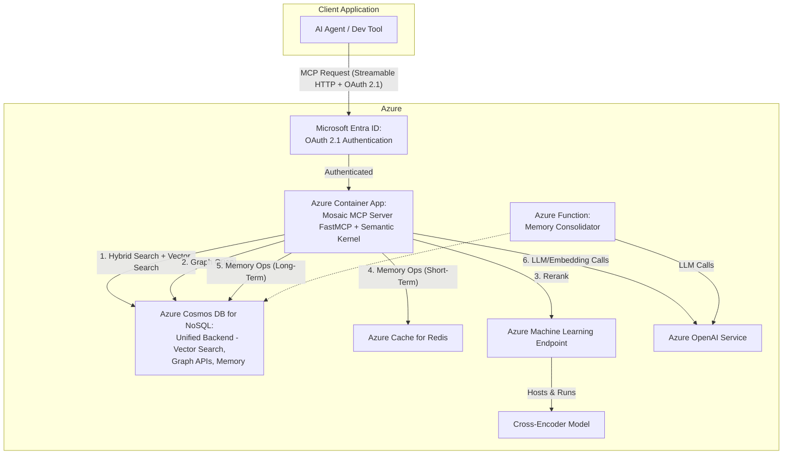

# Technical Design Document: Mosaic MCP Tool v1.0

| Field   | Value       |
|---------|-------------|
| Status  | In Development |
| Version | 1.1         |
| Date    | 2025-07-14  |
| Author  | Chris McKee |

## 1.0 Introduction

### 1.1 Purpose

This document outlines the comprehensive technical architecture and design for the Mosaic Model Context Protocol (MCP) Tool. It serves as the engineering translation of the Product Requirements Document (PRD) v1.4, detailing the implementation plan for building a high-performance, scalable context engine on the Microsoft Azure platform.

### 1.2 Goals of this Document

The primary goal is to provide a detailed engineering blueprint for the development team. This TDD covers the end-to-end design, including system architecture, component-level design, technology stack, data models, API definitions, and operational considerations. It is intended to be the single source of truth for the technical implementation of the Mosaic MCP Tool.

## 2.0 High-Level System Architecture

### 2.1 Architectural Overview

The Mosaic MCP Tool is designed as a cloud-native microservices-based system hosted entirely on Azure. The core of the system is the Mosaic MCP Server, a persistent, containerized process that acts as a centralized context engine for various AI applications and developer tools. This server is built upon the Python Semantic Kernel, which provides a modular, plugin-based architecture for orchestrating AI workflows.

Client applications connect to the server via Streamable HTTP transport to receive context streams. The server, in turn, orchestrates a series of calls to a unified Azure Cosmos DB backend and other managed Azure services to fulfill these requests. This architecture ensures scalability, modularity, and high performance by leveraging the OmniRAG pattern with a simplified, unified data backend, aligning perfectly with the requirements outlined in the PRD.

### 2.2 System Diagram

The following C4-style diagram illustrates the key system components and their interactions.



## 3.0 Technology Stack

| Component | Technology | Rationale & PRD Requirement(s) |
|-----------|------------|--------------------------------|
| Core Framework | Python Semantic Kernel | Aligns with FR-2; provides a robust plugin architecture for modularity and orchestration. |
| LLM & Embedding Models | Azure OpenAI Service (GPT-4o 2024-11-20, text-embedding-3-small) | Provides enterprise-grade, secure, and scalable access to latest GPT and embedding models. |
| Hosting | Azure Container Apps | Best-in-class for containerized microservices. Superior KEDA-based autoscaling is ideal for handling variable loads of persistent MCP/SSE connections (FR-1, FR-4). |
| Communication | FastMCP Framework | Modern, high-performance MCP server framework that handles Streamable HTTP transport and protocol compliance (FR-3). |
| **Authentication** | **Azure Managed Identity** | **Secure, credential-free authentication across all Azure services. Eliminates connection string management and follows 2025 security best practices.** |
| Unified Data Backend | Azure Cosmos DB for NoSQL (with Vector Search) | Provides unified vector search, keyword search, graph operations, and memory storage in a single service, implementing the OmniRAG pattern (FR-5, FR-6, FR-10). |
| Graph Operations | Azure Cosmos DB for NoSQL (Embedded JSON Relationships) | Graph relationships modeled directly within NoSQL documents using embedded arrays like dependency_ids and developers, following Microsoft's OmniRAG pattern (FR-6, FR-4). |
| Long-Term Memory | Azure Cosmos DB (NoSQL API) | Scalable, schema-flexible NoSQL store for persistent agent memory (FR-10, FR-4). Uses managed identity authentication. |
| Short-Term Memory | Azure Cache for Redis (with Entra ID) | High-speed in-memory cache with Azure AD authentication enabled for secure, managed identity access (FR-10). |
| Memory Consolidation | Azure Functions (Timer Trigger) | Serverless, event-driven compute for running the background memory consolidation task (FR-11). |
| Semantic Reranking | Azure Machine Learning Endpoint | Hosts the cross-encoder/ms-marco-MiniLM-L-12-v2 model. Provides a secure, scalable, and fully managed endpoint for semantic reranking (FR-8). |
| Developer Tooling | Azure Developer CLI (azd) with AVM | Primary development tool that streamlines provisioning and deployment workflows using Azure Verified Modules for consistency and best practices. |
| MCP Authorization | Microsoft Entra ID (OAuth 2.1) | Implements MCP Authorization specification for secure authentication and authorization of client connections (FR-14). |

## 4.0 Detailed Component Design

### 4.1 Core Server Implementation (FR-1, FR-3, FR-14)

The server will be a Python application using the FastMCP framework, which handles the Streamable HTTP transport protocol and OAuth 2.1 authentication automatically. A central Kernel instance will be initialized on startup, loading all necessary plugins and AI service connectors.

#### 4.1.1 Hosting Platform: Azure Container Apps

The Mosaic MCP Server will be deployed as a Docker container to Azure Container Apps (ACA). ACA is the superior choice for this workload because its KEDA-based, event-driven scaling is perfectly suited for managing the long-running, variable-load SSE connections inherent to the MCP protocol.

#### 4.1.2 MCP Framework: FastMCP

**Framework Choice:** We will use the FastMCP Python library, which is the industry-accepted framework for building MCP servers. FastMCP handles all low-level protocol details including Streamable HTTP transport and OAuth 2.1 authentication.

**Implementation Benefits:** FastMCP accelerates development by providing a high-level, Pythonic interface and guarantees MCP protocol compliance, allowing developers to focus on building the plugin logic rather than protocol implementation.

#### 4.1.3 Authentication Architecture (OAuth 2.1 + Managed Identity)

**Client Authentication:** OAuth 2.1 with Microsoft Entra ID as the identity provider, implementing the MCP Authorization specification. FastMCP handles the OAuth flow automatically.

**Azure Service Authentication:** All Azure service connections use Azure Managed Identity with `DefaultAzureCredential` from the Azure Identity SDK. This eliminates the need for connection strings, API keys, and manual credential management.

**Implementation Pattern:**
```python
from azure.identity import DefaultAzureCredential
from semantic_kernel.connectors.ai.azure_openai import AzureChatCompletion
from fastmcp import FastMCP

# OAuth 2.1 for MCP clients
mcp = FastMCP("Mosaic MCP Tool")
mcp.configure_oauth(provider="entra_id", tenant_id=os.getenv("AZURE_TENANT_ID"))

# Managed Identity for Azure services
credential = DefaultAzureCredential()
chat_service = AzureChatCompletion(
    deployment_name="gpt-4",
    endpoint=os.getenv("AZURE_OPENAI_ENDPOINT"),
    ad_token_provider=get_bearer_token_provider(
        credential, "https://cognitiveservices.azure.com/.default"
    )
)
```

**Benefits:**
- Production-ready security with OAuth 2.1
- Zero credential management overhead for Azure services
- Automatic token rotation and renewal
- Enhanced security with no stored secrets
- Seamless integration with Container Apps system-assigned identity

### 4.2 RetrievalPlugin (FR-5, FR-6, FR-7) - OmniRAG Implementation

- **HybridSearch (Native Function):** Implemented using Azure Cosmos DB for NoSQL's integrated vector search capabilities, combining semantic vector search with keyword search in a single service.
- **GraphCode (Native Function):** Queries library documents using embedded JSON relationships (dependency_ids, developers arrays) following the OmniRAG pattern. Uses standard Cosmos DB NoSQL SDK with managed identity authentication.
- **AggregateCandidates (Native Function):** A utility function to combine and de-duplicate results from the unified Cosmos DB backend.

#### 4.2.1 OmniRAG Graph Implementation (FR-6)

**Data Model:** Graph relationships are embedded directly in NoSQL documents using JSON arrays:
- `dependency_ids`: Array of library dependencies
- `developers`: Array of developer identifiers
- `used_by_lib`: References to libraries that depend on this one

**Query Pattern:** Uses NoSQL document queries with array operations instead of graph traversals, enabling efficient relationship analysis within the unified Cosmos DB backend.

**Authentication:** Uses managed identity authentication with Cosmos DB Contributor role for secure, credential-free access.

#### 4.2.2 Universal Graph Ingestion System (FR-6.1 through FR-6.5) - CRITICAL IMPLEMENTATION GAP

**CURRENT STATUS:** The existing RetrievalPlugin can query graph relationships but lacks the fundamental graph ingestion pipeline to populate the graph. This represents a critical architectural gap that must be addressed.

**ARCHITECTURAL PARADIGM SHIFT:** Instead of building language-specific parsers, we implement a **universal graph node insertion system** that is completely content-agnostic. This enables ingestion of any structured content: code, documentation, file structures, dependency graphs, etc.

**Universal Node Insertion (FR-6.1):**

- **Content-Agnostic Design:** Single MCP function to insert any type of node into the graph
- **Flexible Node Types:** Support for files, classes, functions, markdown documents, directories, dependencies, etc.
- **Relationship Mapping:** Universal relationship system using typed connections
- **Metadata Support:** Extensible metadata system for any content type

**Repository Structure Ingestion (FR-6.2):**

- **File System Traversal:** Universal file/directory structure ingestion
- **Content Type Detection:** Automatic detection of file types and content patterns
- **Hierarchical Relationships:** Parent-child relationships for file structures
- **Cross-References:** Automatic detection of references between files (imports, links, etc.)

**Content Parsing (FR-6.3):**

- **Code Parsing:** Optional language-specific parsers for detailed code analysis
- **Markdown Processing:** Link extraction and cross-reference detection
- **Configuration Files:** YAML, JSON, TOML parsing for dependency information
- **Documentation Links:** Automatic relationship detection between documentation files

**Universal Graph Construction (FR-6.4):**

- **Node Creation:** Generic node creation with type, content, and metadata
- **Relationship Inference:** Automatic relationship detection based on content patterns
- **Embedding Generation:** Content-aware embedding generation for any node type
- **Cosmos DB Population:** Universal storage pattern for all node types

**Example Node Types:**
- `file_node`: Represents any file in the repository
- `directory_node`: Represents folder structures
- `code_entity`: Classes, functions, methods (language-specific)
- `markdown_document`: Documentation files with cross-references
- `dependency_reference`: External dependencies and imports
- `configuration_item`: Settings, environment variables, etc.

**Real-time Updates (FR-6.4):**

**Two Distinct Usage Patterns:**

**Pattern A: Repository-Based Auto-Monitoring**

- **GitHub App Integration:** Repository permissions (`contents:read`, `metadata:read`)
- **Webhook Processing:** Endpoints for push/PR events (`/webhooks/github`)
- **Branch Subscription:** Automated main/dev monitoring + configurable custom branches
- **Self-healing Cleanup:** Auto-removal of deleted branches during health checks
- **Background Processing:** Queue system (Redis/Celery) to avoid blocking MCP responses
- **MCP Integration:** Server-side automation, no direct client interaction

**Pattern B: Local/Manual Agent-Driven Updates**

- **MCP Client Functions:** Manual trigger functions with streaming progress
- **Dependency Analysis:** AST parsing and import tracking for changed files
- **AI Agent Integration:** Prompt engineering for "modify code → update graph" workflow
- **Streaming Support:** Server-Sent Events (SSE) for long-running operations
- **Connection Management:** Extended HTTP connections with backpressure handling
- **Error Recovery:** Recoverable partial failures without full restart

**Technical Implementation:**

- **File Watching:** Use watchdog library for filesystem monitoring (Pattern B)
- **Git Hooks:** Support for pre-commit and post-merge hooks (Pattern B)
- **Webhook Integration:** GitHub/GitLab webhook notifications (Pattern A)
- **Incremental Processing:** Update only changed files and their dependencies
- **Progress Streaming:** JSON progress messages during processing
- **MCP Functions:** `subscribe_repository_branch`, `update_graph_manual`, `analyze_code_changes`

**AI Integration (FR-6.5):**

- **Generated Code Insertion:** Function to add AI-generated code to the graph
- **Entity Correlation:** Automatic relationship inference for new code
- **Impact Analysis:** Dependency impact assessment for code changes
- **Conflict Resolution:** Handle concurrent updates to the same entities

### 4.3 RefinementPlugin (FR-8)

This plugin improves the precision of retrieved context.

#### 4.3.1 Reranking Model: cross-encoder/ms-marco-MiniLM-L-12-v2

**Model Specification:** We will use the `cross-encoder/ms-marco-MiniLM-L-12-v2` model from Hugging Face. This specific model provides an excellent balance of high performance on ranking benchmarks and computational efficiency, making it the ideal choice for v1.0.

**Hosting:** The model will be deployed to a dedicated Azure Machine Learning Endpoint. This is the standard, production-grade approach as it provides a scalable, reliable, and secure REST API for the model, isolating its computational needs from the core MCP server.

#### 4.3.2 Implementation

**Rerank (Native Function):** This function is a lightweight wrapper that uses httpx to make a secure API call to the Azure Machine Learning Endpoint.

### 4.4 MemoryPlugin (FR-9, FR-10, FR-11)

**Unified Interface:** A HybridMemory class abstracts all storage logic.

**Storage Logic (OmniRAG Pattern):**

- **Short-Term:** Uses a standard Semantic Kernel RedisMemoryStore connector for session-based memory.
- **Long-Term:** Uses the unified Azure Cosmos DB for NoSQL backend with vector search capabilities, implementing a custom CosmosDBMemoryStore class inheriting from SK's MemoryStore base class.

**Consolidation Process:** An Azure Function on a timer trigger will use a Kernel configured with the Azure OpenAI connector to summarize conversations and update the long-term store.

### 4.5 DiagramPlugin (FR-12, FR-13)

**GenerateMermaid (Semantic Function):** A Semantic Function with a prompt template processed by a GPT model on Azure OpenAI.

## 5.0 Data Models & Schemas

### 5.1 Cosmos DB Memory Schema (NoSQL API)

```json
{
  "id": "unique_memory_id",
  "sessionId": "user_or_agent_session_id",
  "type": "episodic | semantic | procedural",
  "content": "The user confirmed that the 'auth-service' should be written in Go.",
  "embedding": [0.012, "...", -0.045],
  "importanceScore": 0.85,
  "timestamp": "2025-07-09T12:05:00Z",
  "metadata": {
    "source": "conversation_summary",
    "tool_id": "mosaic.memory.save",
    "conversation_turn": 5
  }
}
```

### 5.2 Universal Graph Schema with Content-Agnostic Node System

**Universal Node Document Example:**
```json
{
  "id": "repo_myproject_src_auth_py",
  "node_type": "file_node",
  "name": "auth.py",
  "path": "src/auth.py",
  "content_type": "python",
  "repository_context": {
    "repo_url": "https://github.com/myorg/myproject",
    "branch": "feature/auth-improvements",
    "commit_hash": "abc123def456",
    "source_type": "local",
    "last_modified": "2025-07-14T10:30:00Z"
  },
  "content_summary": "User authentication module with login/logout functionality",
  "relationships": {
    "contains": ["repo_myproject_src_auth_py_User_class", "repo_myproject_src_auth_py_login_function"],
    "imports": ["repo_myproject_src_database_py", "repo_myproject_src_utils_py"],
    "parent": "repo_myproject_src_directory",
    "references": ["docs_authentication_md"]
  },
  "embedding": [0.012, "...", -0.045],
  "metadata": {
    "file_size": 1024,
    "line_count": 45,
    "created_by": "developer",
    "last_updated": "2025-07-14T10:30:00Z",
    "tags": ["authentication", "security", "user-management"]
  }
}
```

**Code Entity Node Example:**
```json
{
  "id": "repo_myproject_src_auth_py_User_class",
  "node_type": "code_entity",
  "name": "User",
  "path": "src/auth.py",
  "content_type": "python_class",
  "repository_context": {
    "repo_url": "https://github.com/myorg/myproject",
    "branch": "feature/auth-improvements",
    "commit_hash": "abc123def456",
    "source_type": "local",
    "last_modified": "2025-07-14T10:30:00Z"
  },
  "content_summary": "User class with authentication and session management",
  "relationships": {
    "contained_by": "repo_myproject_src_auth_py",
    "uses": ["repo_myproject_src_database_py_Database_class"],
    "methods": ["repo_myproject_src_auth_py_User_login_method", "repo_myproject_src_auth_py_User_logout_method"]
  },
  "embedding": [0.012, "...", -0.045],
  "metadata": {
    "language": "python",
    "entity_type": "class",
    "docstring": "User authentication and session management class",
    "start_line": 10,
    "end_line": 45
  }
}
```

**Documentation Node Example:**
```json
{
  "id": "docs_authentication_md",
  "node_type": "markdown_document",
  "name": "authentication.md",
  "path": "docs/authentication.md",
  "content_type": "markdown",
  "repository_context": {
    "repo_url": "https://github.com/myorg/myproject",
    "branch": "main",
    "source_type": "remote",
    "last_modified": "2025-07-10T14:20:00Z"
  },
  "content_summary": "Documentation for authentication system implementation",
  "relationships": {
    "documents": ["repo_myproject_src_auth_py", "repo_myproject_src_auth_py_User_class"],
    "links_to": ["docs_user_guide_md", "docs_security_md"],
    "parent": "docs_directory"
  },
  "embedding": [0.012, "...", -0.045],
  "metadata": {
    "doc_type": "technical_documentation",
    "sections": ["Overview", "Implementation", "API Reference"],
    "word_count": 1250
  }
}
```

**Universal Relationship Types:**
- `contains`: Parent-child relationships (directory → file, file → class)
- `imports`: Code dependencies and imports
- `references`: Cross-references between any content types
- `documents`: Documentation describing code entities
- `links_to`: Hyperlinks and cross-references in documentation
- `depends_on`: General dependency relationships
- `uses`: Usage relationships between entities
- `implements`: Implementation relationships

**Node Type Categories:**
- `file_node`: Any file in the repository
- `directory_node`: Folder structures
- `code_entity`: Classes, functions, methods, variables
- `markdown_document`: Documentation files
- `configuration_item`: Config files, environment variables
- `dependency_reference`: External dependencies and packages
- `custom_node`: Extensible for any other content type

## 6.0 MCP Interface Definition

| Function Signature | Description |
|-------------------|-------------|
| `mosaic.retrieval.hybrid_search(query: str) -> List[Document]` | Performs parallel vector and keyword search. |
| `mosaic.retrieval.query_code_graph(library_id: str, relationship_type: str) -> List[LibraryNode]` | Queries embedded graph relationships in NoSQL documents using OmniRAG pattern. |
| **UNIVERSAL GRAPH INGESTION FUNCTIONS (CRITICAL IMPLEMENTATION GAP)** | |
| `mosaic.ingestion.insert_node(node_type: str, name: str, path: str, content_summary: str, metadata: dict) -> NodeResult` | **[MISSING]** Universal node insertion for any content type. |
| `mosaic.ingestion.create_relationship(source_id: str, target_id: str, relationship_type: str, metadata: dict) -> RelationshipResult` | **[MISSING]** Creates typed relationships between any nodes. |
| `mosaic.ingestion.ingest_file_structure(root_path: str, filters: List[str]) -> StructureResult` | **[MISSING]** Ingests file/directory structure as graph nodes. |
| `mosaic.ingestion.ingest_repository(repo_url: str, branch: str, filters: List[str]) -> IngestionResult` | **[MISSING]** Clones repository and ingests complete structure. |
| `mosaic.ingestion.parse_content_references(node_id: str, content: str) -> List[Reference]` | **[MISSING]** Extracts cross-references from any content type. |
| `mosaic.ingestion.update_node_content(node_id: str, content_summary: str, metadata: dict) -> UpdateResult` | **[MISSING]** Updates existing node content and metadata. |
| `mosaic.ingestion.query_nodes_by_type(node_type: str, filters: dict) -> List[Node]` | **[MISSING]** Queries nodes by type and optional filters. |
| `mosaic.ingestion.traverse_relationships(node_id: str, relationship_type: str, depth: int) -> List[Node]` | **[MISSING]** Traverses graph relationships from a starting node. |
| **SPECIALIZED CONTENT PROCESSORS** | |
| `mosaic.ingestion.process_code_file(file_path: str, language: str) -> List[CodeEntity]` | **[MISSING]** Optional: Extract code entities from programming files. |
| `mosaic.ingestion.process_markdown_file(file_path: str) -> MarkdownDocument` | **[MISSING]** Optional: Extract links and references from markdown. |
| `mosaic.ingestion.process_config_file(file_path: str, config_type: str) -> List[ConfigItem]` | **[MISSING]** Optional: Extract configuration items and dependencies. |
| `mosaic.ingestion.subscribe_repository_branch(repo_url: str, branch: str, webhook_url: str) -> SubscriptionResult` | **[MISSING]** Sets up GitHub App webhook subscription for repository branch monitoring. |
| `mosaic.ingestion.update_graph_manual(changes: List[FileChange]) -> UpdateResult` | **[MISSING]** Manual graph updates with streaming progress (Pattern B). |
| `mosaic.ingestion.analyze_code_changes(file_paths: List[str]) -> DependencyAnalysis` | **[MISSING]** Analyzes code dependencies and impact of changes (both patterns). |
| `mosaic.ingestion.get_update_progress(operation_id: str) -> ProgressStatus` | **[MISSING]** Stream-compatible status for long-running operations. |
| `mosaic.ingestion.insert_generated_code(code: str, context: dict) -> InsertResult` | **[MISSING]** Inserts AI-generated code into graph with correlation. |
| **LOCAL/REMOTE STATE MANAGEMENT** | |
| `mosaic.ingestion.transition_local_to_remote(entity_ids: List[str], commit_hash: str) -> TransitionResult` | **[MISSING]** Transitions local entities to remote after successful commit. |
| `mosaic.ingestion.create_local_variant(remote_entity_id: str, local_changes: dict) -> LocalEntityResult` | **[MISSING]** Creates local variant of remote entity for development. |
| `mosaic.ingestion.resolve_state_conflicts(repo_url: str, branch: str) -> ConflictResolution` | **[MISSING]** Resolves local/remote state conflicts during sync. |
| `mosaic.ingestion.query_by_source_type(source_type: str, repo_context: dict) -> List[CodeEntity]` | **[MISSING]** Queries entities by source type and repository context. |
| **EXISTING FUNCTIONS** | |
| `mosaic.refinement.rerank(query: str, documents: List[Document]) -> List[Document]` | Reranks a list of documents for semantic relevance to a query. |
| `mosaic.memory.save(session_id: str, content: str, type: str)` | Saves a piece of information to the agent's memory. |
| `mosaic.memory.retrieve(session_id: str, query: str, limit: int) -> List[MemoryEntry]` | Retrieves relevant entries from the agent's memory based on a query. |
| `mosaic.diagram.generate(description: str) -> str` | Converts a natural language description into Mermaid diagram syntax. |

### 6.1 Implementation Priority

**CRITICAL:** The code ingestion functions represent the most important missing functionality. Without these, the system cannot populate the knowledge graph with actual codebase data, rendering the AI-assisted development vision incomplete.

## 7.0 Deployment & Operations (AI Foundry & AZD)

### 7.1 CI/CD Pipeline

A CI/CD pipeline will be implemented using GitHub Actions. The pipeline will leverage the Azure Developer CLI (azd) as the primary deployment tool to simplify all deployment steps.

- **On Push to main:** Run linters, unit tests, and security scans.
- **On Release Tag:** A GitHub Actions workflow will use `azd auth` and `azd deploy` to push the new version of the application and infrastructure to Azure.
- **OAuth 2.1 Integration:** CI/CD pipeline will validate MCP Authorization compliance during deployment.

### 7.2 Infrastructure as Code

All Azure resources will be defined and provisioned using Bicep templates. The Azure Developer CLI will use these templates to create and manage the environment.

### 7.3 Developer Experience: Azure Developer CLI (azd) - Primary Tool

The Azure Developer CLI (azd) is the primary development tool for this project. It uses our simplified Bicep templates and application code, enabling developers to provision and deploy the entire unified architecture with a single command: `azd up`. The simplified OmniRAG architecture reduces the complexity of the deployment significantly.

## 8.0 Cost Optimization & POC SKUs

For the initial Development and Proof of Concept phase, the following simplified service SKUs will be used to minimize costs while retaining all necessary functionality. The OmniRAG pattern significantly reduces infrastructure complexity and cost by eliminating the need for a separate search service.

| Service | Recommended POC SKU | Justification & Feature Validation |
|---------|-------------------|-----------------------------------|
| Azure Container Apps | Consumption Plan | Serverless, pay-per-use plan with a generous monthly free grant. Scales to zero, costing nothing when idle. Fully supports all required features. |
| Azure Cosmos DB for NoSQL | Free Tier Offer (Serverless) | Provides the first 1000 RU/s and 25 GB of storage free. This single account hosts vector search, NoSQL (long-term memory), and embedded graph relationships, implementing the unified OmniRAG pattern. |
| Azure Cache for Redis | Basic (C0) Tier | The lowest-cost tier, designed for dev/test. Provides a 250MB cache, which is ample for short-term session memory during development. |
| Azure Machine Learning | Pay-as-you-go | The workspace itself has no cost. The deployed endpoint will use a low-cost, CPU-based compute instance (e.g., Standard_DS2_v2), which will be manually started and stopped to control costs. |
| Azure Functions | Consumption Plan | Serverless plan with a large monthly free grant on executions and resource usage. Perfect for our periodic memory consolidation job. |
| Azure OpenAI Service | Pay-as-you-go | Cost is managed by limiting usage and API calls during the POC. No specific SKU to select. |

## 9.0 Research & Validation Requirements

### 9.1 Technology Research Protocol

**MANDATORY:** All implementation must be validated against 2025's most current best practices using the following tools:

1. **Context7 MCP Tool:** Primary research tool for obtaining up-to-date documentation and best practices
2. **Web Search:** Cross-reference Context7 results with current web sources
3. **Fetch/API Validation:** Verify API endpoints and compatibility with latest service versions

### 9.2 Implementation Research Checklist

Before implementing any component, developers must:

- [ ] Use Context7 to research latest library versions and breaking changes
- [ ] Validate Azure service compatibility with current SDK versions
- [ ] Cross-reference parsing tools (AST, tree-sitter) for multi-language support
- [ ] Research current best practices for code embedding and vectorization
- [ ] Validate MCP protocol compliance with latest specification
- [ ] Research OAuth 2.1 implementation patterns with Microsoft Entra ID

### 9.3 Continuous Validation

- **Monthly Reviews:** Re-validate key technology choices using Context7
- **Dependency Updates:** Research impact of dependency updates before applying
- **Security Reviews:** Validate authentication and authorization patterns

## 10.0 Out of Scope

- **Multi-Agent Collaboration:** While the MCP architecture enables this, v1.0 will focus on single-agent/single-user context. Explicit features for memory sharing and conflict resolution between multiple agents are out of scope.

- **Advanced Access Control:** While OAuth 2.1 provides basic authentication and authorization, granular, user-level access control for specific memory entries or context resources will be deferred to future versions.

- **UI/Frontend:** This is a backend tool. No user interface will be developed as part of this PRD.