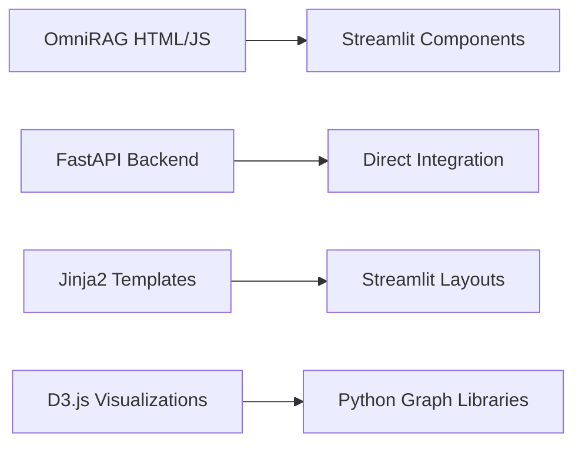

# Mosaic UI Modernization Action Plan

## OmniRAG Integration & Azure Container Apps Deployment

> **Project Goal:** Transform the current basic Streamlit application into a comprehensive, enterprise-grade web interface that matches and exceeds the capabilities of the CosmosAIGraph OmniRAG reference implementation.

---

## 📊 Current State Analysis

### **Existing Mosaic UI Assessment**

| Component               | Current State                       | Status             | Gap Analysis                            |
| ----------------------- | ----------------------------------- | ------------------ | --------------------------------------- |
| **Streamlit App**       | Basic validation tool (1,113 lines) | ✅ Functional      | Limited features, static visualizations |
| **Graph Visualization** | Hardcoded mock data                 | ⚠️ Demo only       | No real-time data integration           |
| **Chat Interface**      | None                                | ❌ Missing         | Core OmniRAG feature absent             |
| **SPARQL Console**      | None                                | ❌ Missing         | Critical graph query capability         |
| **Vector Search**       | None                                | ❌ Missing         | Essential AI/RAG functionality          |
| **Dependencies**        | Lightweight (Streamlit + Pydantic)  | ✅ Good foundation | Missing Azure integrations              |
| **Deployment**          | Local only                          | ❌ Missing         | No containerization or cloud deployment |

### **OmniRAG Reference Implementation Features**

Based on the CosmosAIGraph analysis, the target implementation includes:

#### **Core Views & Features**

- 🗨️ **Conversational AI Console** (`conv_ai_console.html`)
- 🔍 **Natural Language to SPARQL Generator** (`gen_sparql_console.html`)
- ⚡ **Direct SPARQL Query Console** (`sparql_console.html`)
- 🧠 **Vector Search Interface** (`vector_search_console.html`)
- 📊 **Interactive Graph Visualizations** (D3.js force-directed graphs)
- ℹ️ **About/Metadata Display** (`about.html`)

#### **Advanced Capabilities**

- Real-time chat with conversation history
- Dynamic SPARQL query generation from natural language
- Interactive dependency graphs with zoom/pan
- Vector similarity search with embedding visualization
- Ontology exploration and visualization
- User feedback collection and analysis

---

## 🔄 Comparison with OmniRAG Implementation

### **Feature Mapping: OmniRAG → Mosaic UI**

| OmniRAG Feature       | Implementation Technology    | Mosaic UI Equivalent             | Priority  |
| --------------------- | ---------------------------- | -------------------------------- | --------- |
| **Conversational AI** | FastAPI + Jinja2 templates   | Streamlit Chat Elements          | 🔴 HIGH   |
| **SPARQL Generation** | Python + Azure OpenAI        | Streamlit + Azure OpenAI SDK     | 🔴 HIGH   |
| **D3.js Graph Viz**   | JavaScript + Vis.js          | Streamlit-Agraph / PyVis         | 🔴 HIGH   |
| **Vector Search**     | Azure Cosmos DB + embeddings | Same backend, Streamlit frontend | 🔴 HIGH   |
| **Interactive Forms** | HTML forms + JavaScript      | Streamlit widgets                | 🟡 MEDIUM |
| **Real-time Updates** | WebSocket/SSE                | Streamlit auto-refresh           | 🟡 MEDIUM |
| **User Feedback**     | Ajax POST requests           | Streamlit forms                  | 🟢 LOW    |

### **Technology Translation Strategy**



**Key Advantages of Streamlit Approach:**

- 🐍 **Pure Python**: No HTML/CSS/JavaScript complexity
- 🔄 **Reactive**: Automatic state management and updates
- 📦 **Rich Ecosystem**: Access to entire Python data science stack
- 🚀 **Rapid Development**: Faster iteration and deployment

---

## 🎯 Streamlit App Development Strategy

### **Phase 1: Core Infrastructure (Week 1)**

#### **1.1 Enhanced Application Architecture**

```python
# Proposed structure
src/mosaic-ui/
├── app.py                     # Main Streamlit application
├── pages/                     # Multi-page application
│   ├── 01_🗨️_Conversational_AI.py
│   ├── 02_🔍_SPARQL_Generator.py
│   ├── 03_⚡_SPARQL_Console.py
│   ├── 04_🧠_Vector_Search.py
│   └── 05_📊_Graph_Explorer.py
├── components/                # Reusable UI components
│   ├── chat_interface.py
│   ├── graph_visualizer.py
│   ├── sparql_editor.py
│   └── vector_search.py
├── services/                  # Backend integrations
│   ├── mosaic_client.py       # MCP/Mosaic service client
│   ├── openai_client.py       # Azure OpenAI integration
│   └── cosmos_client.py       # Direct Cosmos DB access
├── utils/                     # Utility functions
│   ├── auth.py               # Azure AD authentication
│   ├── formatting.py         # Data presentation helpers
│   └── caching.py            # Performance optimization
├── assets/                   # Static resources
├── requirements.txt          # Dependencies
└── Dockerfile               # Container configuration
```

#### **1.2 Advanced Graph Visualization Libraries**

**Research & Selection Matrix:**

| Library                   | Use Case                   | Pros                          | Cons                    | Recommendation       |
| ------------------------- | -------------------------- | ----------------------------- | ----------------------- | -------------------- |
| **Streamlit-Agraph**      | Interactive network graphs | Native Streamlit integration  | Limited customization   | ⭐ Primary Choice    |
| **PyVis**                 | HTML-based networks        | Rich interactions, Gephi-like | External HTML embedding | ⭐ Secondary         |
| **Plotly Graph Objects**  | Custom interactive plots   | Highly customizable           | Complex for networks    | 🔄 Specific uses     |
| **NetworkX + Matplotlib** | Scientific visualization   | Powerful algorithms           | Static output           | 📊 Analysis only     |
| **Bokeh**                 | Interactive web plots      | Professional dashboards       | Steep learning curve    | 🎯 Advanced features |

**Implementation Example:**

```python
import streamlit as st
from streamlit_agraph import agraph, Node, Edge, Config

def render_dependency_graph(dependencies_data):
    nodes = [Node(id=lib, label=lib, size=25) for lib in dependencies_data.keys()]
    edges = [Edge(source=lib, target=dep)
             for lib, deps in dependencies_data.items()
             for dep in deps]

    config = Config(width=750, height=600,
                   directed=True, physics=True,
                   hierarchical=False)

    return agraph(nodes=nodes, edges=edges, config=config)
```

### **Phase 2: Feature Implementation (Week 2-3)**

#### **2.1 Conversational AI Interface**

- **Chat History Management**: Streamlit session state for conversation persistence
- **Streaming Responses**: Real-time AI response display
- **Context Awareness**: Integration with Mosaic MCP memory system
- **Multi-turn Conversations**: Thread management and context preservation

#### **2.2 SPARQL Query Generation & Execution**

- **Natural Language Input**: Text area with example queries
- **AI-Powered Translation**: Azure OpenAI integration for NL→SPARQL
- **Query Validation**: Syntax checking and error handling
- **Results Visualization**: Table display with export options

#### **2.3 Interactive Graph Explorer**

- **Real-time Data Loading**: Direct Cosmos DB integration
- **Zoom/Pan Controls**: Navigation within large graphs
- **Node Details**: Click interactions for entity information
- **Filter Options**: Dynamic graph subset exploration

#### **2.4 Vector Search Interface**

- **Semantic Search**: Embedding-based similarity queries
- **Result Ranking**: Relevance scoring and visualization
- **Query Suggestions**: Auto-complete and example queries
- **Similarity Visualization**: Vector space representation

### **Phase 3: Advanced Features (Week 3-4)**

#### **3.1 Performance Optimization**

```python
# Caching strategy
@st.cache_data(ttl=300)  # 5-minute cache
def load_graph_data(container_name):
    return cosmos_client.query_container(container_name)

@st.cache_resource  # Singleton pattern
def get_openai_client():
    return AzureOpenAI(endpoint=os.getenv("AZURE_OPENAI_ENDPOINT"))
```

#### **3.2 Authentication & Security**

- **Azure AD Integration**: Single sign-on capability
- **Role-based Access**: Different UI capabilities by user role
- **Secure Configuration**: Azure Key Vault integration

#### **3.3 Real-time Features**

- **Auto-refresh**: Periodic data updates
- **Progress Indicators**: Long-running operation feedback
- **Error Handling**: Graceful degradation and user feedback

---

## 🚀 Azure Container Apps Deployment Strategy

### **Current Infrastructure Gaps**

#### **Missing Components:**

1. **Azure Container Registry (ACR)** - No centralized container storage
2. **Mosaic UI Container App** - Not defined in infrastructure
3. **Health Check Endpoints** - Missing for containerized services
4. **Scaling Configuration** - No auto-scaling rules defined

### **Infrastructure Updates Required**

#### **4.1 Azure Container Registry Integration**

**Update `infra/resources.bicep`:**

```bicep
// Add Azure Container Registry
resource containerRegistry 'Microsoft.ContainerRegistry/registries@2023-01-01-preview' = {
  name: 'cr${abbrs.containerRegistry}${environmentName}'
  location: location
  sku: {
    name: 'Basic'
  }
  properties: {
    adminUserEnabled: true
  }
  tags: tags
}

// Output registry details for service deployment
output containerRegistryLoginServer string = containerRegistry.properties.loginServer
output containerRegistryName string = containerRegistry.name
```

#### **4.2 Mosaic UI Container App Configuration**

**Create `infra/mosaic-ui.bicep`:**

```bicep
param environmentName string
param location string = resourceGroup().location
param tags object = {}
param containerAppsEnvironmentName string
param containerRegistryName string
param serviceName string = 'mosaic-ui'

resource containerAppsEnvironment 'Microsoft.App/managedEnvironments@2023-05-01' existing = {
  name: containerAppsEnvironmentName
}

resource containerRegistry 'Microsoft.ContainerRegistry/registries@2023-01-01-preview' existing = {
  name: containerRegistryName
}

resource mosaicUiApp 'Microsoft.App/containerApps@2023-05-01' = {
  name: 'ca-${serviceName}-${environmentName}'
  location: location
  tags: union(tags, { 'azd-service-name': serviceName })
  properties: {
    managedEnvironmentId: containerAppsEnvironment.id
    configuration: {
      ingress: {
        external: true
        targetPort: 8501  // Streamlit default port
        allowInsecure: false
      }
      registries: [
        {
          server: containerRegistry.properties.loginServer
          identity: 'system'
        }
      ]
    }
    template: {
      containers: [
        {
          image: '${containerRegistry.properties.loginServer}/${serviceName}:latest'
          name: serviceName
          env: [
            {
              name: 'MOSAIC_COSMOS_ENDPOINT'
              value: cosmos_endpoint
            }
            {
              name: 'AZURE_OPENAI_ENDPOINT'
              value: openai_endpoint
            }
          ]
          resources: {
            cpu: json('0.5')
            memory: '1Gi'
          }
          probes: [
            {
              type: 'liveness'
              httpGet: {
                path: '/health'
                port: 8501
              }
              initialDelaySeconds: 30
              periodSeconds: 10
            }
          ]
        }
      ]
      scale: {
        minReplicas: 1
        maxReplicas: 3
        rules: [
          {
            name: 'http-scale'
            http: {
              metadata: {
                concurrentRequests: '10'
              }
            }
          }
        ]
      }
    }
  }
}
```

#### **4.3 Health Check Implementation**

**Add to Streamlit app (`src/mosaic-ui/app.py`):**

```python
import streamlit as st
from threading import Thread
import uvicorn
from fastapi import FastAPI

# Health check API alongside Streamlit
health_app = FastAPI()

@health_app.get("/health")
async def health_check():
    return {"status": "healthy", "service": "mosaic-ui"}

@health_app.get("/liveness")
async def liveness_check():
    return {"status": "alive"}

# Run health API in background thread
def run_health_server():
    uvicorn.run(health_app, host="0.0.0.0", port=8502)

if __name__ == "__main__":
    # Start health check server
    health_thread = Thread(target=run_health_server, daemon=True)
    health_thread.start()

    # Run Streamlit app
    st.set_page_config(page_title="Mosaic UI", layout="wide")
    # ... rest of Streamlit app
```

### **4.4 Container Build & Deployment Pipeline**

**Update `azure.yaml`:**

```yaml
services:
  # ... existing services ...

  mosaic-ui:
    project: ./src/mosaic-ui
    host: containerapp
    language: python
    env:
      MOSAIC_COSMOS_ENDPOINT: ${MOSAIC_COSMOS_ENDPOINT}
      AZURE_OPENAI_ENDPOINT: ${AZURE_OPENAI_ENDPOINT}
      AZURE_CLIENT_ID: ${AZURE_CLIENT_ID}
      STREAMLIT_SERVER_PORT: "8501"
      STREAMLIT_SERVER_ADDRESS: "0.0.0.0"
```

**Dockerfile optimization (`src/mosaic-ui/Dockerfile`):**

```dockerfile
FROM python:3.12-slim

WORKDIR /app

# Install system dependencies
RUN apt-get update && apt-get install -y \
    build-essential \
    curl \
    && rm -rf /var/lib/apt/lists/*

# Copy requirements and install Python dependencies
COPY requirements.txt .
RUN pip install --no-cache-dir -r requirements.txt

# Copy application code
COPY . .

# Expose ports for Streamlit and health checks
EXPOSE 8501 8502

# Health check
HEALTHCHECK --interval=30s --timeout=3s --start-period=5s --retries=3 \
  CMD curl -f http://localhost:8502/health || exit 1

# Run application
CMD ["streamlit", "run", "app.py", "--server.port=8501", "--server.address=0.0.0.0"]
```

---

## 📋 Action Items & Timeline

### **🏃‍♂️ Sprint 1: Foundation (Week 1)**

| Task ID       | Task                                    | Owner    | Duration | Dependencies | Status         |
| ------------- | --------------------------------------- | -------- | -------- | ------------ | -------------- |
| **FR-UI-002** | **OmniRAG Analysis & Feature Mapping**  | Dev Team | 3 days   | None         | 🔄 In Progress |
| **FR-UI-004** | **Azure Container Registry Setup**      | DevOps   | 2 days   | None         | 📋 TODO        |
|               | Update `infra/resources.bicep` with ACR | DevOps   | 1 day    | FR-UI-004    | 📋 TODO        |
|               | Configure service identity permissions  | DevOps   | 0.5 days | ACR creation | 📋 TODO        |

### **🏗️ Sprint 2: Core Development (Week 2)**

| Task ID       | Task                                   | Owner  | Duration | Dependencies         | Status  |
| ------------- | -------------------------------------- | ------ | -------- | -------------------- | ------- |
| **FR-UI-003** | **Graph Visualization Implementation** | UI Dev | 5 days   | FR-UI-002            | 📋 TODO |
|               | Research & select graph libraries      | UI Dev | 1 day    | Analysis complete    | 📋 TODO |
|               | Implement Streamlit-Agraph integration | UI Dev | 2 days   | Library selection    | 📋 TODO |
|               | Create interactive dependency viewer   | UI Dev | 2 days   | Basic integration    | 📋 TODO |
| **FR-UI-005** | **Container App Infrastructure**       | DevOps | 3 days   | FR-UI-004            | 📋 TODO |
|               | Create `mosaic-ui.bicep` template      | DevOps | 1 day    | ACR ready            | 📋 TODO |
|               | Configure health checks & scaling      | DevOps | 1 day    | Basic template       | 📋 TODO |
|               | Update `azure.yaml` service definition | DevOps | 0.5 days | Infrastructure ready | 📋 TODO |

### **⚡ Sprint 3: Feature Implementation (Week 3)**

| Task ID       | Task                                | Owner  | Duration | Dependencies       | Status  |
| ------------- | ----------------------------------- | ------ | -------- | ------------------ | ------- |
| **FR-UI-001** | **Core UI Features Implementation** | UI Dev | 5 days   | FR-UI-003          | 📋 TODO |
|               | Conversational AI interface         | UI Dev | 2 days   | Graph viz complete | 📋 TODO |
|               | SPARQL generator & console          | UI Dev | 2 days   | AI interface       | 📋 TODO |
|               | Vector search interface             | UI Dev | 1 day    | SPARQL console     | 📋 TODO |
|               | Integration testing                 | QA     | 2 days   | All features       | 📋 TODO |

### **🚀 Sprint 4: Deployment & Optimization (Week 4)**

| Task                              | Owner   | Duration | Dependencies             | Status  |
| --------------------------------- | ------- | -------- | ------------------------ | ------- |
| **End-to-end deployment testing** | DevOps  | 2 days   | All development complete | 📋 TODO |
| **Performance optimization**      | UI Dev  | 2 days   | Deployment testing       | 📋 TODO |
| **User acceptance testing**       | Product | 2 days   | Performance optimization | 📋 TODO |
| **Production deployment**         | DevOps  | 1 day    | UAT approval             | 📋 TODO |

---

## 🔬 Research & Development Areas

### **Advanced Visualization Research**

#### **Graph Rendering Performance**

- **WebGL acceleration** for large graph datasets (1000+ nodes)
- **Hierarchical clustering** for complex dependency trees
- **Real-time updates** without full page refresh
- **Export capabilities** (PNG, SVG, GraphML)

#### **AI/ML Integration Opportunities**

- **Graph embeddings** for similarity-based clustering
- **Anomaly detection** in dependency graphs
- **Recommendation systems** for code relationships
- **Natural language graph queries** beyond SPARQL

### **Streamlit Ecosystem Extensions**

#### **Custom Components**

```python
# Potential custom components for advanced features
streamlit_graph_explorer = create_component(
    "graph-explorer",
    url="http://localhost:3001",  # React development server
    key="graph_explorer"
)

# Advanced search with autocomplete
streamlit_semantic_search = create_component(
    "semantic-search",
    path="./frontend/build",
    key="semantic_search"
)
```

#### **Performance Enhancements**

- **Concurrent data loading** with async/await patterns
- **Progressive loading** for large datasets
- **Client-side caching** strategies
- **CDN integration** for static assets

### **Enterprise Features**

#### **Authentication & Authorization**

- **Azure AD B2C** for external users
- **Role-based UI customization**
- **Audit logging** for user interactions
- **Multi-tenant support** for different organizations

#### **Analytics & Monitoring**

- **Application Insights** integration for usage analytics
- **Custom metrics** for graph exploration patterns
- **Performance monitoring** for query response times
- **User behavior tracking** for UX optimization

---

## 🎯 Success Metrics & KPIs

### **Technical Metrics**

- ⚡ **Page Load Time**: < 3 seconds initial load
- 🔄 **Query Response Time**: < 5 seconds for graph queries
- 📊 **Graph Rendering**: Support 500+ nodes without performance degradation
- 🎪 **Uptime**: 99.9% availability SLA
- 🛡️ **Security**: Zero critical vulnerabilities

### **User Experience Metrics**

- 👥 **User Adoption**: 80% of developers use new UI within 30 days
- 📈 **Feature Utilization**: All major features used by 60% of users
- ⭐ **User Satisfaction**: 4.5/5 average rating
- 🕐 **Time to Insight**: 50% reduction in time to find code relationships

### **Business Metrics**

- 💰 **Development Efficiency**: 25% faster code exploration workflows
- 🎯 **Feature Completeness**: 100% parity with OmniRAG capabilities
- 🔄 **Deployment Success**: Zero-downtime deployments
- 📚 **Documentation Coverage**: 90% of features documented

---

## 🚨 Risk Mitigation & Contingency Plans

### **Technical Risks**

| Risk                                  | Impact | Probability | Mitigation Strategy                              | Contingency Plan              |
| ------------------------------------- | ------ | ----------- | ------------------------------------------------ | ----------------------------- |
| **Streamlit Performance Limitations** | High   | Medium      | Early performance testing, optimization research | Fallback to FastAPI + React   |
| **Graph Visualization Complexity**    | Medium | Medium      | POC with multiple libraries                      | Use simpler table-based views |
| **Azure Integration Issues**          | High   | Low         | Incremental testing, staging environment         | Manual deployment process     |
| **OmniRAG Feature Gaps**              | Medium | Low         | Thorough analysis phase                          | Phased feature rollout        |

### **Resource Risks**

| Risk                       | Impact | Probability | Mitigation Strategy             | Contingency Plan             |
| -------------------------- | ------ | ----------- | ------------------------------- | ---------------------------- |
| **Developer Availability** | High   | Medium      | Cross-training, documentation   | Extended timeline            |
| **Azure Resource Costs**   | Medium | Low         | Cost monitoring, optimization   | Resource scaling adjustments |
| **Timeline Pressures**     | Medium | Medium      | Agile methodology, MVP approach | Feature prioritization       |

---

## 📚 Dependencies & Prerequisites

### **External Dependencies**

- ✅ **Azure Subscription** with Container Apps enabled
- ✅ **Azure OpenAI Service** deployment
- ✅ **Azure Cosmos DB** with vector search capability
- 🔄 **Azure Container Registry** (to be created)
- 📋 **Development Environment** with Python 3.12+

### **Team Prerequisites**

- 👩‍💻 **UI Developer** with Streamlit expertise
- 🛠️ **DevOps Engineer** with Azure Container Apps experience
- 🧪 **QA Engineer** for testing coordination
- 📋 **Product Owner** for feature prioritization

### **Technical Prerequisites**

- 🔧 **Local Development Setup** with Docker
- 🌐 **Staging Environment** for integration testing
- 🔐 **Security Review** for authentication flows
- 📊 **Monitoring Setup** for performance tracking

---

**🎯 Next Steps:** Begin with Task FR-UI-002 (OmniRAG Analysis) to establish detailed feature requirements and technical specifications. This foundation will inform all subsequent development and deployment decisions.

**📅 Target Completion:** 4 weeks from project initiation  
**🎯 Success Criteria:** Full-featured Mosaic UI deployed to Azure Container Apps with parity to OmniRAG capabilities
