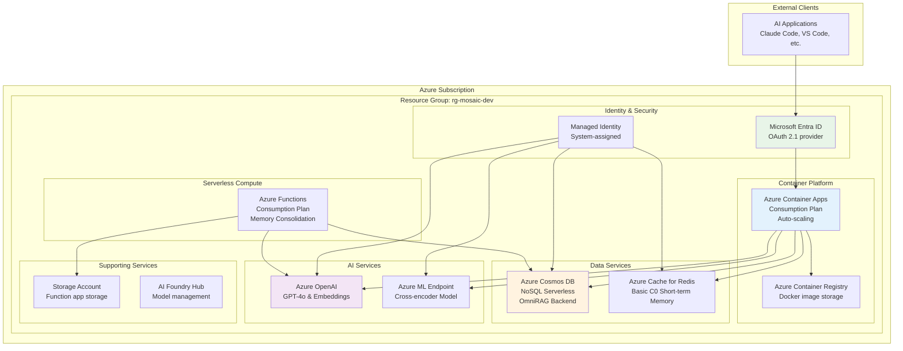

# Azure Infrastructure Architecture

This document details the Azure services architecture and deployment patterns for the Mosaic MCP Tool.

## Azure Infrastructure Overview



## Cost Optimization & POC SKUs

For the initial Development and Proof of Concept phase, the following service SKUs minimize costs while retaining all necessary functionality:

| Service | POC SKU | Justification & Cost Benefits |
|---------|---------|-------------------------------|
| Azure Container Apps | Consumption Plan | Serverless, pay-per-use with generous free grant. Scales to zero when idle. |
| Azure Cosmos DB | Free Tier Offer (Serverless) | First 1000 RU/s and 25 GB storage free. Unified backend for all data operations. |
| Azure Cache for Redis | Basic (C0) Tier | Lowest-cost tier, 250MB cache sufficient for development workloads. |
| Azure Machine Learning | Pay-as-you-go | Workspace free, endpoint uses CPU compute that can be started/stopped. |
| Azure Functions | Consumption Plan | Serverless with large monthly free grant for periodic consolidation jobs. |
| Azure OpenAI Service | Pay-as-you-go | Cost controlled by API usage limits during development phase. |

## Service Configurations

### Azure Container Apps

```bicep
resource containerApp 'Microsoft.App/containerApps@2023-05-01' = {
  name: 'mosaic-mcp-server'
  location: location
  properties: {
    managedEnvironmentId: containerAppEnvironment.id
    configuration: {
      secrets: [
        {
          name: 'azure-openai-endpoint'
          value: openAIService.properties.endpoint
        }
      ]
      ingress: {
        external: true
        targetPort: 8000
        transport: 'http'
      }
      dapr: {
        enabled: false
      }
    }
    template: {
      containers: [
        {
          name: 'mosaic-mcp-server'
          image: '${containerRegistry.properties.loginServer}/mosaic-mcp-server:latest'
          env: [
            {
              name: 'AZURE_OPENAI_ENDPOINT'
              secretRef: 'azure-openai-endpoint'
            }
            {
              name: 'AZURE_COSMOS_DB_ENDPOINT'
              value: cosmosDbAccount.properties.documentEndpoint
            }
          ]
          resources: {
            cpu: json('0.5')
            memory: '1.0Gi'
          }
        }
      ]
      scale: {
        minReplicas: 0
        maxReplicas: 10
        rules: [
          {
            name: 'http-scale'
            http: {
              metadata: {
                concurrentRequests: '10'
              }
            }
          }
        ]
      }
    }
  }
  identity: {
    type: 'SystemAssigned'
  }
}
```

### Azure Cosmos DB Configuration

```bicep
resource cosmosDbAccount 'Microsoft.DocumentDB/databaseAccounts@2023-04-15' = {
  name: 'mosaic-cosmos-${uniqueString(resourceGroup().id)}'
  location: location
  kind: 'GlobalDocumentDB'
  properties: {
    consistencyPolicy: {
      defaultConsistencyLevel: 'Session'
    }
    locations: [
      {
        locationName: location
        failoverPriority: 0
        isZoneRedundant: false
      }
    ]
    capabilities: [
      {
        name: 'EnableServerless'
      }
      {
        name: 'EnableNoSQLVectorSearch'
      }
    ]
    databaseAccountOfferType: 'Standard'
  }
}

resource cosmosDatabase 'Microsoft.DocumentDB/databaseAccounts/sqlDatabases@2023-04-15' = {
  parent: cosmosDbAccount
  name: 'mosaic'
  properties: {
    resource: {
      id: 'mosaic'
    }
  }
}

resource documentsContainer 'Microsoft.DocumentDB/databaseAccounts/sqlDatabases/containers@2023-04-15' = {
  parent: cosmosDatabase
  name: 'documents'
  properties: {
    resource: {
      id: 'documents'
      partitionKey: {
        paths: ['/type']
        kind: 'Hash'
      }
      indexingPolicy: {
        vectorIndexes: [
          {
            path: '/embedding'
            type: 'quantizedFlat'
          }
        ]
      }
    }
  }
}
```

### Azure Functions Configuration

```bicep
resource functionApp 'Microsoft.Web/sites@2023-01-01' = {
  name: 'mosaic-memory-consolidator'
  location: location
  kind: 'functionapp'
  properties: {
    serverFarmId: appServicePlan.id
    siteConfig: {
      appSettings: [
        {
          name: 'AzureWebJobsStorage'
          value: 'DefaultEndpointsProtocol=https;AccountName=${storageAccount.name};EndpointSuffix=${environment().suffixes.storage};AccountKey=${storageAccount.listKeys().keys[0].value}'
        }
        {
          name: 'FUNCTIONS_EXTENSION_VERSION'
          value: '~4'
        }
        {
          name: 'FUNCTIONS_WORKER_RUNTIME'
          value: 'python'
        }
        {
          name: 'AZURE_COSMOS_DB_ENDPOINT'
          value: cosmosDbAccount.properties.documentEndpoint
        }
        {
          name: 'AZURE_OPENAI_ENDPOINT'
          value: openAIService.properties.endpoint
        }
      ]
      pythonVersion: '3.11'
    }
  }
  identity: {
    type: 'SystemAssigned'
  }
}
```

## Deployment Architecture

### Azure Developer CLI (azd) Structure

```text
infra/
├── main.bicep                 # Main infrastructure template
├── main.parameters.json       # Environment-specific parameters
├── modules/
│   ├── container-apps.bicep   # Container Apps module
│   ├── cosmos-db.bicep        # Cosmos DB module
│   ├── openai.bicep          # Azure OpenAI module
│   └── functions.bicep        # Azure Functions module
└── abbreviations.json         # Azure resource abbreviations
```

### Deployment Process

```bash
# Initialize project
azd init

# Provision infrastructure
azd provision

# Deploy application
azd deploy

# Full deployment
azd up
```

## Security Architecture

### Managed Identity Configuration

```bicep
// Cosmos DB role assignment
resource cosmosDbRoleAssignment 'Microsoft.DocumentDB/databaseAccounts/sqlRoleAssignments@2023-04-15' = {
  parent: cosmosDbAccount
  name: guid(cosmosDbAccount.id, containerApp.id, 'DocumentDB Data Contributor')
  properties: {
    principalId: containerApp.identity.principalId
    roleDefinitionId: '${cosmosDbAccount.id}/sqlRoleDefinitions/00000000-0000-0000-0000-000000000002'
    scope: cosmosDbAccount.id
  }
}

// OpenAI role assignment
resource openAIRoleAssignment 'Microsoft.Authorization/roleAssignments@2022-04-01' = {
  scope: openAIService
  name: guid(openAIService.id, containerApp.id, 'OpenAI User')
  properties: {
    principalId: containerApp.identity.principalId
    roleDefinitionId: subscriptionResourceId('Microsoft.Authorization/roleDefinitions', '5e0bd9bd-7b93-4f28-af87-19fc36ad61bd')
  }
}
```

### OAuth 2.1 Configuration

```bicep
resource entraApp 'Microsoft.Graph/applications@v1.0' = {
  displayName: 'Mosaic MCP Server'
  signInAudience: 'AzureADMyOrg'
  api: {
    oauth2PermissionScopes: [
      {
        id: guid('mosaic-search')
        value: 'mosaic.search'
        type: 'User'
        adminConsentDisplayName: 'Access search functionality'
        adminConsentDescription: 'Allow access to hybrid search and retrieval'
      }
      {
        id: guid('mosaic-memory')
        value: 'mosaic.memory'
        type: 'User'
        adminConsentDisplayName: 'Access memory operations'
        adminConsentDescription: 'Allow read/write access to agent memory'
      }
    ]
  }
}
```

## Monitoring and Observability

### Application Insights Integration

```bicep
resource applicationInsights 'Microsoft.Insights/components@2020-02-02' = {
  name: 'mosaic-app-insights'
  location: location
  kind: 'web'
  properties: {
    Application_Type: 'web'
    Request_Source: 'rest'
    WorkspaceResourceId: logAnalyticsWorkspace.id
  }
}
```

### Log Analytics Workspace

```bicep
resource logAnalyticsWorkspace 'Microsoft.OperationalInsights/workspaces@2022-10-01' = {
  name: 'mosaic-log-analytics'
  location: location
  properties: {
    sku: {
      name: 'PerGB2018'
    }
    retentionInDays: 30
  }
}
```

## Scaling and Performance

### Auto-scaling Configuration

- **Container Apps**: KEDA-based scaling on HTTP requests and message queues
- **Cosmos DB**: Serverless automatic scaling based on RU consumption
- **Functions**: Event-driven scaling for timer triggers
- **Redis**: Manual scaling when needed (Basic to Standard tiers)

### Performance Targets

- **API Response Time**: < 200ms for hybrid search
- **Memory Operations**: < 100ms for save/retrieve
- **Diagram Generation**: < 5 seconds for complex diagrams
- **Consolidation**: < 30 seconds for hourly memory processing

## Disaster Recovery

### Backup Strategy

- **Cosmos DB**: Point-in-time restore with 7-day retention
- **Container Images**: Multi-region registry replication
- **Function Code**: Source code in Git repository
- **Configuration**: Infrastructure as Code in version control

### High Availability

- **Multi-region**: Primary region with failover capability
- **Load Balancing**: Traffic Manager for global load distribution
- **Health Checks**: Comprehensive health monitoring
- **Auto-recovery**: Automatic restart of failed services

## Related Documentation

- **[System Overview](system-overview.md)** - High-level architecture
- **[Security Authentication](security-auth.md)** - Security patterns
- **[MCP Protocol Flow](mcp-protocol-flow.md)** - Communication protocols
