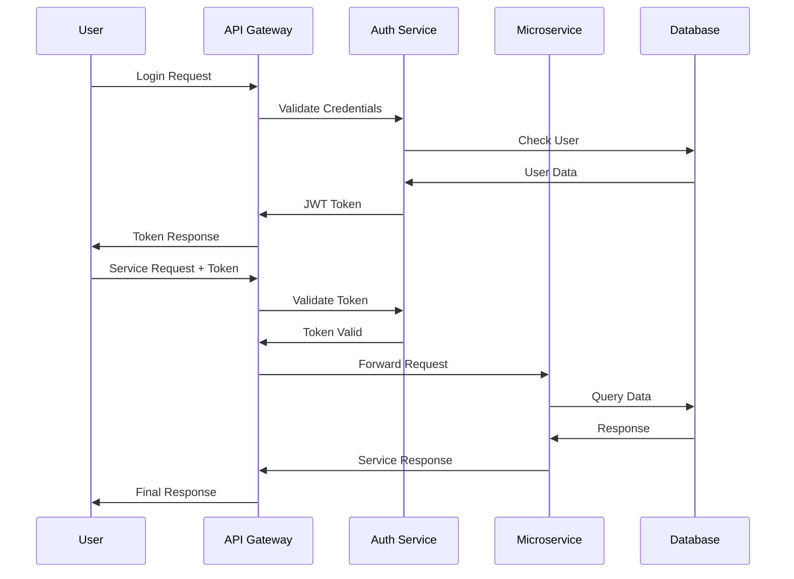
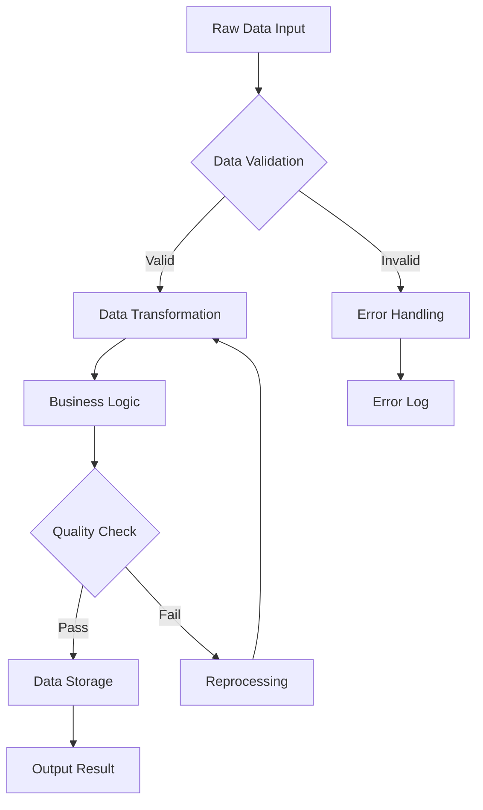

# Diagram Generation Architecture

This document details the Mermaid diagram generation and management processes for the Mosaic MCP Tool.

## Diagram Generation Process (FR-12-13)

```mermaid
stateDiagram-v2
    [*] --> InputReceived: Natural Language Description
    
    InputReceived --> TypeDetection: Analyze Description
    
    TypeDetection --> FlowChart: process, workflow, steps
    TypeDetection --> Sequence: interaction, communication, API
    TypeDetection --> Class: object, inheritance, relationship
    TypeDetection --> ER: database, table, schema
    TypeDetection --> Journey: user journey, experience
    TypeDetection --> Gantt: timeline, project, schedule
    
    FlowChart --> PromptGeneration: Create Specific Prompt
    Sequence --> PromptGeneration: Create Specific Prompt
    Class --> PromptGeneration: Create Specific Prompt
    ER --> PromptGeneration: Create Specific Prompt
    Journey --> PromptGeneration: Create Specific Prompt
    Gantt --> PromptGeneration: Create Specific Prompt
    
    PromptGeneration --> LLMCall: Azure OpenAI GPT-4o
    LLMCall --> SyntaxCleaning: Remove markdown, validate
    
    SyntaxCleaning --> Validation: Check diagram syntax
    Validation --> Storage: Store in Cosmos DB
    Storage --> ResourceRegistration: Register as MCP Resource
    
    ResourceRegistration --> [*]: Return Mermaid Syntax
    
    Validation --> Fallback: Invalid syntax
    Fallback --> [*]: Return simple diagram
```

## Diagram Type Detection

### Type Detection Logic

```python
type_indicators = {
    "flowchart": ["process", "workflow", "step", "decision", "algorithm"],
    "sequenceDiagram": ["interaction", "communication", "API", "request", "response"],
    "classDiagram": ["class", "object", "inheritance", "relationship"],
    "erDiagram": ["database", "table", "entity", "schema", "foreign key"],
    "journey": ["user journey", "experience", "touchpoint"],
    "gantt": ["timeline", "schedule", "project", "milestone"]
}

def detect_diagram_type(description: str) -> str:
    """Detect the most appropriate Mermaid diagram type"""
    description_lower = description.lower()
    
    type_scores = {}
    for diagram_type, indicators in type_indicators.items():
        score = sum(1 for indicator in indicators if indicator in description_lower)
        if score > 0:
            type_scores[diagram_type] = score
    
    if not type_scores:
        return "flowchart"  # Default fallback
    
    return max(type_scores, key=type_scores.get)
```

### Diagram Type Examples

- **Flowchart**: "User authentication process with decision points"
- **Sequence**: "API interaction between client and server"
- **Class**: "Object-oriented design for user management system"
- **ER**: "Database schema for e-commerce platform"
- **Journey**: "User experience flow for onboarding"
- **Gantt**: "Project timeline with milestones"

## Prompt Engineering

### Base Prompt Template

```python
base_prompt = """
You are an expert at creating Mermaid diagrams from natural language descriptions.

Input: "{description}"
Detected Type: {diagram_type}

Create ONLY the Mermaid syntax - no explanations, no markdown code blocks, no additional text.

Requirements:
- Use proper Mermaid syntax for {diagram_type}
- Include meaningful node labels and relationships
- Keep the diagram clear and readable
- Use appropriate styling where beneficial

Generate the diagram:
"""
```

### Type-Specific Prompt Templates

#### Flowchart Template

```python
flowchart_prompt = """
Create a Mermaid flowchart that shows the process flow with:
- Clear start and end points
- Decision diamonds for choices
- Process rectangles for actions
- Appropriate flow directions
- Meaningful labels

Example format:
flowchart TD
    A[Start] --> B{Decision}
    B -->|Yes| C[Action]
    B -->|No| D[Alternative]
    C --> E[End]
    D --> E
"""
```

#### Sequence Diagram Template

```python
sequence_prompt = """
Create a Mermaid sequence diagram showing interactions between participants:
- Identify key participants/systems
- Show message flows between them
- Include activation boxes where appropriate
- Use notes for important details

Example format:
sequenceDiagram
    participant A as Client
    participant B as Server
    
    A->>B: Request
    B->>A: Response
"""
```

## DiagramPlugin Functions

### generate_mermaid(description: str) -> str

**Purpose**: Converts natural language description to Mermaid diagram syntax

**Implementation**:

1. **Type Detection**: Analyze description to determine diagram type
2. **Prompt Generation**: Create type-specific prompt template
3. **LLM Call**: Use Azure OpenAI GPT-4o for diagram generation
4. **Syntax Cleaning**: Remove markdown and validate syntax
5. **Fallback Handling**: Generate simple diagram if syntax invalid
6. **Storage**: Store generated diagram in Cosmos DB
7. **Resource Registration**: Register as MCP resource

**Sample Usage**:

```python
description = "User authentication flow in a microservice architecture"
diagram_syntax = await generate_mermaid(description)
```

### validate_mermaid_syntax(diagram_text: str) -> bool

**Purpose**: Validates Mermaid syntax for correctness

**Implementation**:

```python
def validate_mermaid_syntax(diagram_text: str) -> bool:
    """Basic Mermaid syntax validation"""
    
    # Check for required diagram type declaration
    diagram_types = [
        "flowchart", "graph", "sequenceDiagram", "classDiagram",
        "erDiagram", "journey", "gantt", "pie", "gitgraph"
    ]
    
    first_line = diagram_text.strip().split('\n')[0]
    if not any(first_line.startswith(dt) for dt in diagram_types):
        return False
    
    # Check for basic syntax issues
    syntax_issues = [
        "```mermaid",  # Should not contain markdown
        "```",         # Should not contain code blocks
        "<script>",    # Should not contain HTML
        "javascript:"  # Should not contain JavaScript
    ]
    
    for issue in syntax_issues:
        if issue in diagram_text:
            return False
    
    return True
```

### store_diagram(diagram_id: str, diagram_text: str, description: str)

**Purpose**: Stores diagram in Cosmos DB and registers as MCP resource

**Implementation**:

```python
async def store_diagram(diagram_id: str, diagram_text: str, description: str):
    """Store diagram in Cosmos DB"""
    
    diagram_doc = {
        "id": diagram_id,
        "type": "mermaid_diagram",
        "description": description,
        "diagram_text": diagram_text,
        "created_at": datetime.utcnow().isoformat(),
        "diagram_type": detect_diagram_type(description),
        "metadata": {
            "source": "mosaic.diagram.generate",
            "version": "1.0"
        }
    }
    
    await cosmos_client.create_item(diagram_doc)
    
    # Register as MCP resource
    await register_mcp_resource(diagram_id, "diagram", diagram_text)
```

## Generated Diagram Examples

### Authentication Flow Example

**Input**: "User authentication flow in microservice architecture"

**Generated Output**:



### Data Processing Pipeline

**Input**: "Data processing pipeline with validation and transformation steps"

**Generated Output**:



## MCP Resource Management

### Resource Registration

```python
async def register_mcp_resource(diagram_id: str, resource_type: str, content: str):
    """Register diagram as MCP resource"""
    
    resource = {
        "uri": f"mermaid://{diagram_id}",
        "name": f"Mermaid Diagram: {diagram_id}",
        "description": f"Generated {resource_type} diagram",
        "mimeType": "text/plain",
        "content": content
    }
    
    await mcp_server.register_resource(resource)
```

### Resource Retrieval

```python
async def get_diagram_resource(diagram_id: str) -> str:
    """Retrieve diagram as MCP resource"""
    
    diagram_doc = await cosmos_client.read_item(diagram_id)
    return diagram_doc["diagram_text"]
```

## Error Handling and Fallbacks

### LLM Failure Fallback

```python
def generate_fallback_diagram(description: str, diagram_type: str) -> str:
    """Generate simple fallback diagram when LLM fails"""
    
    fallback_templates = {
        "flowchart": """
flowchart TD
    A[Start: {description}] --> B[Process]
    B --> C[End]
""",
        "sequenceDiagram": """
sequenceDiagram
    participant A as System A
    participant B as System B
    A->>B: Request
    B->>A: Response
""",
        "classDiagram": """
classDiagram
    class Entity {
        +attribute
        +method()
    }
"""
    }
    
    template = fallback_templates.get(diagram_type, fallback_templates["flowchart"])
    return template.format(description=description[:50])
```

### Syntax Validation Fallback

```python
async def generate_with_validation(description: str) -> str:
    """Generate diagram with syntax validation and retry"""
    
    max_retries = 3
    for attempt in range(max_retries):
        try:
            diagram_text = await call_llm_for_diagram(description)
            
            if validate_mermaid_syntax(diagram_text):
                return diagram_text
            else:
                logger.warning(f"Invalid syntax on attempt {attempt + 1}")
                
        except Exception as e:
            logger.error(f"LLM call failed on attempt {attempt + 1}: {e}")
    
    # Final fallback
    diagram_type = detect_diagram_type(description)
    return generate_fallback_diagram(description, diagram_type)
```

## Performance Considerations

### Caching Strategy

- **Generated Diagrams**: Cache diagrams by description hash
- **Type Detection**: Cache diagram type detection results
- **Validation Results**: Cache syntax validation outcomes

### Optimization Techniques

- **Batch Processing**: Process multiple diagram requests together
- **Prompt Optimization**: Use optimized prompts for faster generation
- **Resource Pooling**: Reuse Azure OpenAI connections

## Related Documentation

- **[System Overview](system-overview.md)** - High-level architecture
- **[Plugin Interactions](plugin-interactions.md)** - Plugin system design
- **[Azure Infrastructure](azure-infrastructure.md)** - Infrastructure deployment
