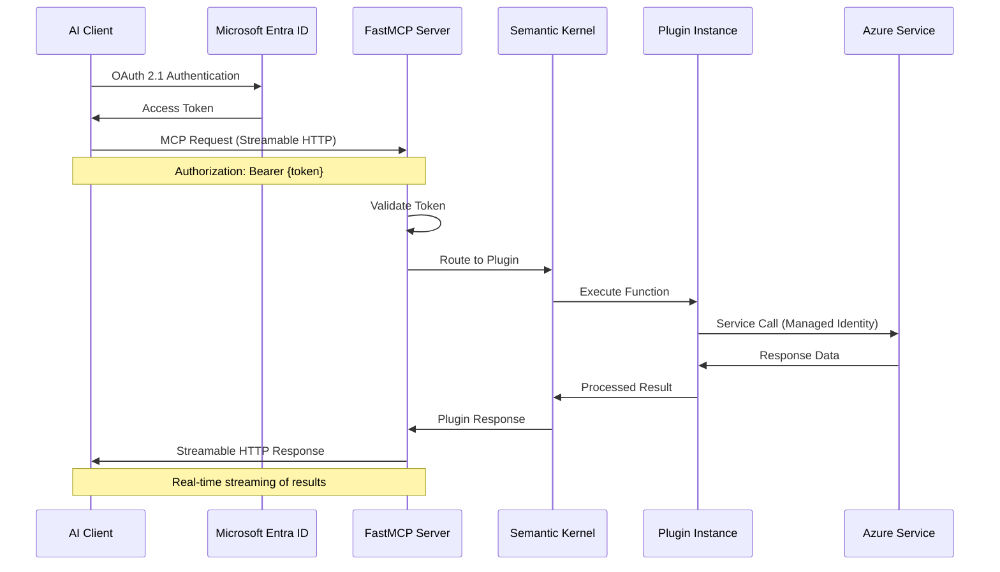

# MCP Protocol Flow

This document details the Model Context Protocol (MCP) communication patterns and flows used in the Mosaic MCP Tool.

## MCP Protocol Sequence Flow



## Process Flow Steps

### 1. Authentication Phase

- **Client Initiation**: AI client initiates OAuth 2.1 flow with Microsoft Entra ID
- **Token Exchange**: Client receives access token and refresh token
- **Token Validation**: FastMCP server validates JWT token on each request

### 2. Request Processing

- **MCP Request**: Client sends standardized MCP request with Bearer token
- **Authorization**: FastMCP validates token and extracts user context
- **Routing**: Request routed to appropriate Semantic Kernel plugin

### 3. Plugin Execution

- **Function Invocation**: Kernel executes requested plugin function
- **Azure Integration**: Plugin authenticates with Azure services using managed identity
- **Data Processing**: Plugin processes data and generates response

### 4. Response Streaming

- **Real-time Response**: Results streamed back via Streamable HTTP
- **Error Handling**: Standardized error responses for failures
- **Session Management**: Maintains connection state for streaming

## MCP Request Examples

### Hybrid Search Request

```json
{
  "method": "tools/call",
  "params": {
    "name": "mosaic.retrieval.hybrid_search",
    "arguments": {
      "query": "authentication patterns in microservices",
      "limit": 10
    }
  }
}
```

### Memory Save Request

```json
{
  "method": "tools/call",
  "params": {
    "name": "mosaic.memory.save",
    "arguments": {
      "session_id": "user_session_xyz",
      "content": "User prefers TypeScript for new projects",
      "type": "semantic"
    }
  }
}
```

### Diagram Generation Request

```json
{
  "method": "tools/call",
  "params": {
    "name": "mosaic.diagram.generate",
    "arguments": {
      "description": "User authentication flow in microservice architecture"
    }
  }
}
```

## Streamable HTTP Transport

### Connection Management

- **Persistent Connections**: Long-lived connections for real-time streaming
- **Connection Pooling**: Efficient resource utilization
- **Auto-reconnection**: Automatic recovery from connection failures

### Error Handling

- **Standardized Errors**: Consistent error response format
- **Retry Logic**: Automatic retry for transient failures
- **Graceful Degradation**: Fallback mechanisms for service failures

### Performance Optimization

- **Streaming Responses**: Real-time result streaming for large datasets
- **Compression**: HTTP compression for efficient bandwidth usage
- **Caching**: Response caching for frequently accessed data

## Security Considerations

### OAuth 2.1 Implementation

- **PKCE Flow**: Proof Key for Code Exchange for enhanced security
- **Token Refresh**: Automatic token renewal for long-running sessions
- **Scope Validation**: Fine-grained permission control

### Request Validation

- **JWT Verification**: Cryptographic signature validation
- **Audience Validation**: Ensures tokens are intended for this service
- **Rate Limiting**: Protection against abuse and DoS attacks

## Related Documentation

- **[Security Authentication](security-auth.md)** - Detailed security patterns
- **[System Overview](system-overview.md)** - High-level architecture
- **[Plugin Interactions](plugin-interactions.md)** - Plugin execution patterns
