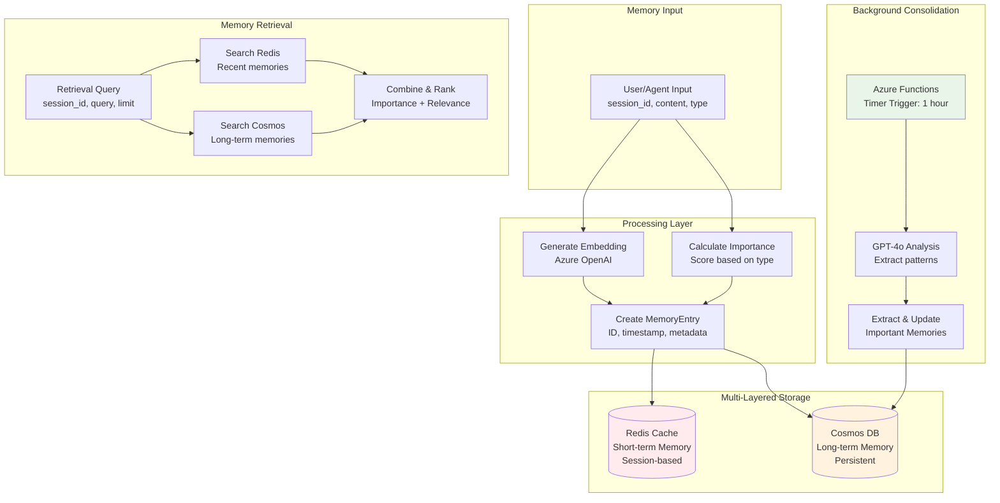

# Memory System Architecture

This document details the multi-layered memory architecture and consolidation processes for the Mosaic MCP Tool.

## Memory System Architecture (FR-9-11)



## Memory Types & Importance Scoring

### Memory Types

- **Episodic** (0.6): Specific events and interactions
- **Semantic** (0.8): General knowledge and facts  
- **Procedural** (0.7): How-to instructions and processes

### Importance Scoring Algorithm

```python
def calculate_importance_score(memory_type: str, content: str, context: dict) -> float:
    base_scores = {
        "episodic": 0.6,
        "semantic": 0.8,
        "procedural": 0.7
    }
    
    # Boost score based on content indicators
    boost_factors = {
        "user_preference": 0.2,
        "critical_decision": 0.3,
        "error_resolution": 0.25,
        "learning_outcome": 0.15
    }
    
    base_score = base_scores.get(memory_type, 0.5)
    
    # Apply boosts based on content analysis
    for indicator, boost in boost_factors.items():
        if indicator in content.lower():
            base_score = min(1.0, base_score + boost)
    
    return base_score
```

## Consolidation Process

### Timer-Based Consolidation

**Schedule**: Azure Functions timer trigger runs every hour

**Process Flow**:

1. **Recent Memory Analysis**: Query memories from last consolidation run
2. **LLM Pattern Recognition**: GPT-4o identifies patterns and key information
3. **Knowledge Extraction**: Extract important facts and relationships
4. **Redundancy Removal**: Merge similar memories to prevent duplication
5. **Long-term Storage**: Update persistent memory with consolidated knowledge

### LLM Consolidation Prompt

```python
consolidation_prompt = """
Analyze the following conversation memories and extract the most important information:

{recent_memories}

Tasks:
1. Identify key decisions, preferences, and learned information
2. Merge similar or redundant memories
3. Highlight critical facts that should be remembered long-term
4. Assign importance scores (0.0-1.0) to each extracted memory

Format as JSON with: summary, importance_score, memory_type, extracted_facts
"""
```

## Memory Data Models

### Memory Entry Schema

```json
{
  "id": "mem_abc123",
  "sessionId": "user_session_xyz",
  "type": "semantic",
  "content": "User prefers using TypeScript for new projects",
  "embedding": [0.012, "...", -0.045],
  "importanceScore": 0.85,
  "timestamp": "2025-07-14T10:30:00Z",
  "metadata": {
    "source": "conversation_summary",
    "consolidation_run": "2025-07-14T11:00:00Z",
    "tool_id": "mosaic.memory.save",
    "conversation_turn": 5
  }
}
```

### Consolidated Memory Schema

```json
{
  "id": "consolidated_mem_xyz",
  "sessionId": "user_session_xyz",
  "type": "semantic",
  "content": "User consistently prefers TypeScript over JavaScript for new projects, particularly for backend services",
  "embedding": [0.015, "...", -0.038],
  "importanceScore": 0.92,
  "timestamp": "2025-07-14T11:00:00Z",
  "metadata": {
    "source": "llm_consolidation",
    "original_memories": ["mem_abc123", "mem_def456", "mem_ghi789"],
    "consolidation_run": "2025-07-14T11:00:00Z",
    "pattern_detected": "user_preference_pattern"
  }
}
```

## MemoryPlugin Functions

### save_memory(session_id: str, content: str, type: str)

**Purpose**: Saves information to the agent's memory system

**Implementation**:

1. Generate content embedding using Azure OpenAI
2. Calculate importance score based on type and content
3. Create memory entry with metadata
4. Store in both Redis (short-term) and Cosmos DB (long-term)
5. Update session context

**Storage Strategy**:

- Redis: TTL-based expiration for session memories
- Cosmos DB: Permanent storage with consolidation processing

### retrieve_memory(session_id: str, query: str, limit: int = 10)

**Purpose**: Retrieves relevant memories based on semantic similarity

**Implementation**:

1. Generate query embedding
2. Search Redis for recent session memories
3. Search Cosmos DB for long-term memories
4. Combine results with relevance scoring
5. Apply importance-based ranking
6. Return top-k most relevant memories

**Ranking Algorithm**:

```python
final_score = (relevance_score * 0.7) + (importance_score * 0.3)
```

### clear_memory(session_id: str, memory_type: str = None)

**Purpose**: Removes memories for a session or specific type

**Implementation**:

1. Clear Redis entries for session
2. Mark Cosmos DB entries as deleted (soft delete)
3. Update session context
4. Log deletion for audit trail

## Performance Optimizations

### Redis Configuration

- **Memory Policy**: allkeys-lru for automatic eviction
- **TTL Strategy**: 24 hours for session memories
- **Connection Pooling**: Efficient connection management
- **Compression**: LZ4 compression for memory efficiency

### Cosmos DB Optimization

- **Partitioning**: Partition by sessionId for query efficiency
- **Indexing**: Optimized indexes for embedding and metadata queries
- **Change Feed**: Real-time consolidation triggers
- **Consistency**: Session consistency for memory operations

### Consolidation Optimization

- **Batch Processing**: Process multiple sessions in single run
- **Incremental Updates**: Only process changed memories
- **Parallel Processing**: Concurrent consolidation for multiple sessions
- **Error Handling**: Robust retry mechanisms for LLM calls

## Memory Retrieval Patterns

### Contextual Retrieval

- **Session Context**: Memories specific to current session
- **Cross-Session**: Important memories from previous sessions
- **Temporal Decay**: Recent memories weighted higher
- **Semantic Similarity**: Vector-based relevance matching

### Hybrid Ranking

- **Recency**: Time-based scoring with exponential decay
- **Importance**: Content-based importance scoring
- **Relevance**: Semantic similarity to query
- **Frequency**: Usage-based popularity scoring

## Related Documentation

- **[System Overview](system-overview.md)** - High-level architecture
- **[Search Retrieval](search-retrieval.md)** - Retrieval mechanisms
- **[Azure Infrastructure](azure-infrastructure.md)** - Infrastructure deployment
