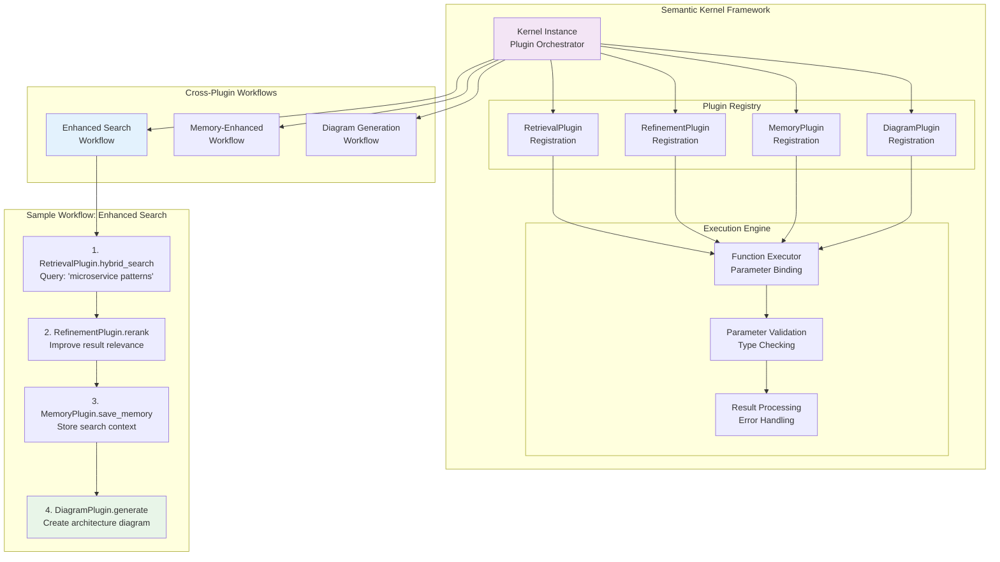

# Plugin Interaction Architecture

This document details the plugin system design and cross-plugin workflows for the Mosaic MCP Tool.

## Plugin Interaction Model



## Plugin Architecture

### Semantic Kernel Plugin Structure

Each plugin in the Mosaic MCP Tool follows the Semantic Kernel plugin pattern:

```python
from semantic_kernel.functions import kernel_function
from semantic_kernel.functions.kernel_arguments import KernelArguments
from typing import Annotated

class RetrievalPlugin:
    """Plugin for hybrid search and code graph operations"""
    
    def __init__(self, cosmos_client, openai_client):
        self.cosmos_client = cosmos_client
        self.openai_client = openai_client
    
    @kernel_function(
        name="hybrid_search",
        description="Performs hybrid vector and keyword search"
    )
    async def hybrid_search(
        self,
        query: Annotated[str, "Search query"],
        limit: Annotated[int, "Maximum results to return"] = 10
    ) -> List[Document]:
        """Hybrid search implementation"""
        # Implementation here
        pass
    
    @kernel_function(
        name="query_code_graph",
        description="Queries code dependency relationships"
    )
    async def query_code_graph(
        self,
        library_id: Annotated[str, "Library identifier"],
        relationship_type: Annotated[str, "Type of relationship to query"]
    ) -> List[LibraryNode]:
        """Graph query implementation"""
        # Implementation here
        pass
```

### Plugin Registration

```python
from semantic_kernel import Kernel
from semantic_kernel.connectors.ai.azure_openai import AzureChatCompletion

class PluginManager:
    def __init__(self):
        self.kernel = Kernel()
        self.setup_ai_services()
        self.register_plugins()
    
    def setup_ai_services(self):
        """Configure AI services for the kernel"""
        chat_service = AzureChatCompletion(
            deployment_name="gpt-4o",
            endpoint=os.getenv("AZURE_OPENAI_ENDPOINT"),
            ad_token_provider=get_bearer_token_provider(
                DefaultAzureCredential(), 
                "https://cognitiveservices.azure.com/.default"
            )
        )
        self.kernel.add_service(chat_service)
    
    def register_plugins(self):
        """Register all plugins with the kernel"""
        # Initialize plugins with dependencies
        retrieval_plugin = RetrievalPlugin(cosmos_client, openai_client)
        refinement_plugin = RefinementPlugin(ml_client)
        memory_plugin = MemoryPlugin(cosmos_client, redis_client)
        diagram_plugin = DiagramPlugin(openai_client)
        
        # Register plugins
        self.kernel.add_plugin(retrieval_plugin, "retrieval")
        self.kernel.add_plugin(refinement_plugin, "refinement")
        self.kernel.add_plugin(memory_plugin, "memory")
        self.kernel.add_plugin(diagram_plugin, "diagram")
```

## Cross-Plugin Workflows

### Enhanced Search Workflow

This workflow demonstrates how multiple plugins work together to provide comprehensive search capabilities:

```python
async def enhanced_search_workflow(
    query: str, 
    session_id: str, 
    limit: int = 10
) -> dict:
    """Enhanced search with memory and visualization"""
    
    # Step 1: Hybrid Search
    search_args = KernelArguments(query=query, limit=50)
    search_result = await kernel.invoke(
        function_name="retrieval.hybrid_search",
        arguments=search_args
    )
    
    # Step 2: Semantic Reranking
    rerank_args = KernelArguments(
        query=query,
        documents=search_result.value,
        limit=limit
    )
    reranked_result = await kernel.invoke(
        function_name="refinement.rerank",
        arguments=rerank_args
    )
    
    # Step 3: Save Search Context to Memory
    memory_args = KernelArguments(
        session_id=session_id,
        content=f"Searched for: {query}",
        type="episodic"
    )
    await kernel.invoke(
        function_name="memory.save_memory",
        arguments=memory_args
    )
    
    # Step 4: Generate Diagram if Architectural Query
    if "architecture" in query.lower() or "system" in query.lower():
        diagram_args = KernelArguments(
            description=f"Architecture diagram for {query}"
        )
        diagram_result = await kernel.invoke(
            function_name="diagram.generate_mermaid",
            arguments=diagram_args
        )
        
        return {
            "documents": reranked_result.value,
            "diagram": diagram_result.value,
            "query": query
        }
    
    return {
        "documents": reranked_result.value,
        "query": query
    }
```

### Memory-Enhanced Retrieval

This workflow incorporates user memory to provide personalized search results:

```python
async def memory_enhanced_retrieval(
    query: str, 
    session_id: str, 
    limit: int = 10
) -> List[Document]:
    """Search enhanced with user memory context"""
    
    # Step 1: Retrieve relevant memories
    memory_args = KernelArguments(
        session_id=session_id,
        query=query,
        limit=5
    )
    memory_result = await kernel.invoke(
        function_name="memory.retrieve_memory",
        arguments=memory_args
    )
    
    # Step 2: Enhance query with memory context
    enhanced_query = f"{query} Context: {memory_result.value}"
    
    # Step 3: Perform hybrid search with enhanced query
    search_args = KernelArguments(
        query=enhanced_query,
        limit=limit
    )
    search_result = await kernel.invoke(
        function_name="retrieval.hybrid_search",
        arguments=search_args
    )
    
    # Step 4: Rerank results
    rerank_args = KernelArguments(
        query=query,  # Use original query for reranking
        documents=search_result.value,
        limit=limit
    )
    final_result = await kernel.invoke(
        function_name="refinement.rerank",
        arguments=rerank_args
    )
    
    return final_result.value
```

### Diagram-Driven Documentation

This workflow creates comprehensive documentation with diagrams:

```python
async def diagram_driven_documentation(
    topic: str, 
    session_id: str
) -> dict:
    """Generate documentation with diagrams"""
    
    # Step 1: Search for relevant information
    search_args = KernelArguments(
        query=f"{topic} documentation patterns",
        limit=20
    )
    search_result = await kernel.invoke(
        function_name="retrieval.hybrid_search",
        arguments=search_args
    )
    
    # Step 2: Generate multiple diagram types
    diagram_types = [
        f"Architecture overview for {topic}",
        f"Data flow diagram for {topic}",
        f"Component interaction for {topic}"
    ]
    
    diagrams = {}
    for diagram_desc in diagram_types:
        diagram_args = KernelArguments(description=diagram_desc)
        diagram_result = await kernel.invoke(
            function_name="diagram.generate_mermaid",
            arguments=diagram_args
        )
        diagrams[diagram_desc] = diagram_result.value
    
    # Step 3: Save documentation context
    memory_args = KernelArguments(
        session_id=session_id,
        content=f"Generated documentation for {topic}",
        type="procedural"
    )
    await kernel.invoke(
        function_name="memory.save_memory",
        arguments=memory_args
    )
    
    return {
        "topic": topic,
        "documents": search_result.value,
        "diagrams": diagrams,
        "context": "comprehensive_documentation"
    }
```

## Plugin Interaction Patterns

### Sequential Execution

Plugins execute in a defined sequence where output from one becomes input to the next:

```python
async def sequential_workflow(initial_input: str):
    """Sequential plugin execution pattern"""
    
    # Plugin 1: Process initial input
    result1 = await plugin1.function(initial_input)
    
    # Plugin 2: Process result from plugin 1
    result2 = await plugin2.function(result1)
    
    # Plugin 3: Process result from plugin 2
    final_result = await plugin3.function(result2)
    
    return final_result
```

### Parallel Execution

Multiple plugins execute simultaneously for improved performance:

```python
async def parallel_workflow(input_data: str):
    """Parallel plugin execution pattern"""
    
    # Execute multiple plugins in parallel
    results = await asyncio.gather(
        plugin1.function(input_data),
        plugin2.function(input_data),
        plugin3.function(input_data)
    )
    
    # Combine results
    combined_result = combine_results(results)
    return combined_result
```

### Conditional Execution

Plugin execution based on conditions or previous results:

```python
async def conditional_workflow(input_data: str, condition: str):
    """Conditional plugin execution pattern"""
    
    # Always execute base plugin
    base_result = await base_plugin.function(input_data)
    
    # Conditional execution based on result
    if condition == "search":
        return await search_plugin.function(base_result)
    elif condition == "memory":
        return await memory_plugin.function(base_result)
    else:
        return base_result
```

### Event-Driven Execution

Plugins react to events from other plugins:

```python
from asyncio import Event

class EventDrivenWorkflow:
    def __init__(self):
        self.search_completed = Event()
        self.memory_updated = Event()
    
    async def start_workflow(self, query: str):
        """Start event-driven workflow"""
        
        # Start search in background
        search_task = asyncio.create_task(
            self.search_and_signal(query)
        )
        
        # Start memory update listener
        memory_task = asyncio.create_task(
            self.wait_for_memory_update()
        )
        
        # Wait for both to complete
        await asyncio.gather(search_task, memory_task)
    
    async def search_and_signal(self, query: str):
        """Search and signal completion"""
        result = await search_plugin.function(query)
        self.search_completed.set()
        return result
    
    async def wait_for_memory_update(self):
        """Wait for memory update signal"""
        await self.memory_updated.wait()
        # React to memory update
        return await process_memory_update()
```

## Plugin Communication

### Data Sharing

Plugins share data through standardized interfaces:

```python
from dataclasses import dataclass
from typing import List, Dict, Any

@dataclass
class PluginContext:
    """Shared context between plugins"""
    session_id: str
    query: str
    user_preferences: Dict[str, Any]
    search_results: List[Document]
    memory_context: List[MemoryEntry]
    metadata: Dict[str, Any]

class ContextManager:
    def __init__(self):
        self.contexts: Dict[str, PluginContext] = {}
    
    def get_context(self, session_id: str) -> PluginContext:
        """Get shared context for session"""
        return self.contexts.get(session_id)
    
    def update_context(self, session_id: str, updates: Dict[str, Any]):
        """Update shared context"""
        if session_id in self.contexts:
            context = self.contexts[session_id]
            for key, value in updates.items():
                setattr(context, key, value)
```

### Error Handling

Robust error handling across plugin interactions:

```python
async def robust_plugin_execution(
    plugin_chain: List[str], 
    input_data: Any
) -> Any:
    """Execute plugin chain with error handling"""
    
    current_data = input_data
    completed_plugins = []
    
    try:
        for plugin_name in plugin_chain:
            plugin = kernel.plugins[plugin_name]
            current_data = await plugin.execute(current_data)
            completed_plugins.append(plugin_name)
            
    except Exception as e:
        logger.error(f"Plugin {plugin_name} failed: {e}")
        
        # Attempt recovery
        if len(completed_plugins) > 0:
            # Return partial results
            return current_data
        else:
            # Return fallback result
            return generate_fallback_result(input_data)
    
    return current_data
```

## Performance Optimization

### Plugin Caching

Cache plugin results to improve performance:

```python
from functools import lru_cache
from typing import Hashable

class PluginCache:
    def __init__(self, max_size: int = 1000):
        self.cache = {}
        self.max_size = max_size
    
    def get(self, key: Hashable) -> Any:
        """Get cached result"""
        return self.cache.get(key)
    
    def set(self, key: Hashable, value: Any):
        """Set cached result"""
        if len(self.cache) >= self.max_size:
            # Remove oldest entry
            oldest_key = next(iter(self.cache))
            del self.cache[oldest_key]
        
        self.cache[key] = value

# Usage in plugin
@lru_cache(maxsize=100)
async def cached_search(query: str) -> List[Document]:
    """Cached search function"""
    return await perform_search(query)
```

### Lazy Loading

Load plugins only when needed:

```python
class LazyPluginLoader:
    def __init__(self):
        self.loaded_plugins = {}
        self.plugin_configs = {
            "retrieval": {"class": RetrievalPlugin, "deps": ["cosmos", "openai"]},
            "refinement": {"class": RefinementPlugin, "deps": ["ml_client"]},
            "memory": {"class": MemoryPlugin, "deps": ["cosmos", "redis"]},
            "diagram": {"class": DiagramPlugin, "deps": ["openai"]}
        }
    
    def get_plugin(self, name: str):
        """Get plugin, loading if necessary"""
        if name not in self.loaded_plugins:
            config = self.plugin_configs[name]
            dependencies = self.get_dependencies(config["deps"])
            self.loaded_plugins[name] = config["class"](**dependencies)
        
        return self.loaded_plugins[name]
```

## Testing Plugin Interactions

### Unit Testing

Test individual plugin functions:

```python
import pytest
from unittest.mock import Mock, AsyncMock

@pytest.fixture
def mock_cosmos_client():
    return Mock()

@pytest.fixture
def mock_openai_client():
    return AsyncMock()

@pytest.mark.asyncio
async def test_hybrid_search(mock_cosmos_client, mock_openai_client):
    """Test hybrid search function"""
    plugin = RetrievalPlugin(mock_cosmos_client, mock_openai_client)
    
    # Mock responses
    mock_openai_client.embeddings.create.return_value.data[0].embedding = [0.1, 0.2, 0.3]
    mock_cosmos_client.query_items.return_value = [{"id": "1", "content": "test"}]
    
    result = await plugin.hybrid_search("test query")
    
    assert len(result) > 0
    assert result[0]["id"] == "1"
```

### Integration Testing

Test cross-plugin workflows:

```python
@pytest.mark.asyncio
async def test_enhanced_search_workflow():
    """Test complete enhanced search workflow"""
    # Setup test data
    query = "microservice architecture"
    session_id = "test_session"
    
    # Execute workflow
    result = await enhanced_search_workflow(query, session_id)
    
    # Verify results
    assert "documents" in result
    assert len(result["documents"]) > 0
    assert result["query"] == query
```

## Related Documentation

- **[System Overview](system-overview.md)** - High-level architecture
- **[Search Retrieval](search-retrieval.md)** - Retrieval plugin details
- **[Memory System](memory-system.md)** - Memory plugin details
- **[Diagram Generation](diagram-generation.md)** - Diagram plugin details
