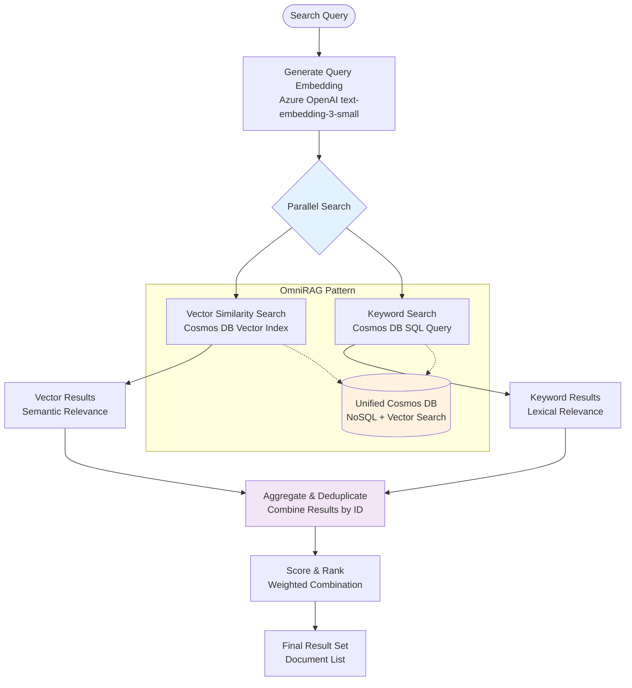
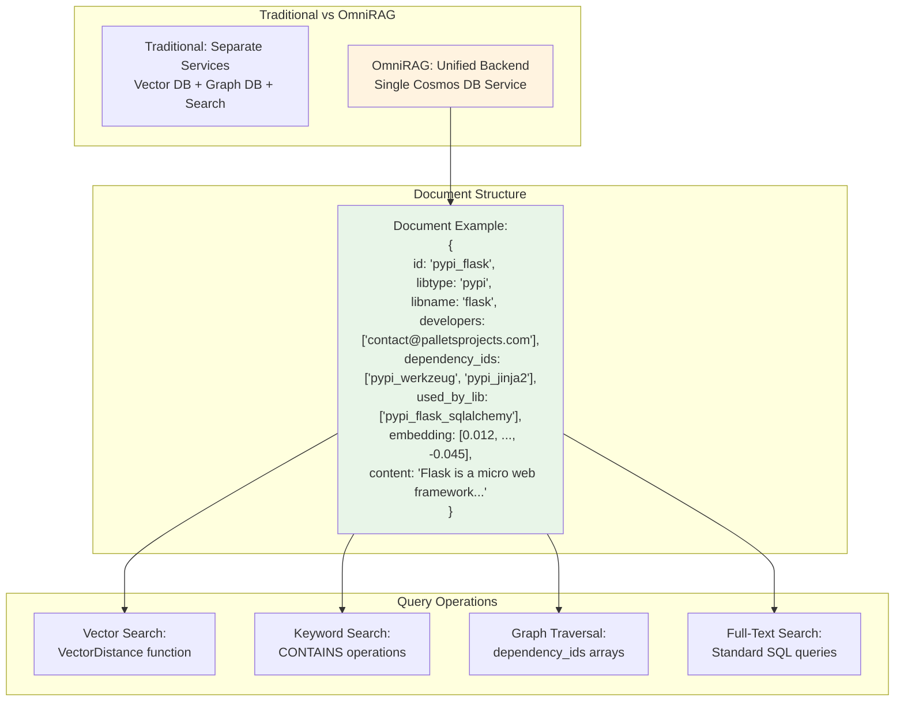

# Search and Retrieval Architecture

This document details the hybrid search architecture and OmniRAG pattern implementation for the Mosaic MCP Tool.

## Hybrid Search Architecture (FR-5)



## Sample Query Flow

1. **Input**: "authentication patterns in microservices"
2. **Embedding**: Convert to 1536-dimensional vector using Azure OpenAI
3. **Vector Search**: Find semantically similar documents in Cosmos DB
4. **Keyword Search**: SQL query for documents containing "authentication", "microservices"
5. **Aggregation**: Combine and deduplicate by document ID
6. **Scoring**: Weight vector results higher, merge with keyword matches
7. **Output**: Ranked list of relevant documents

## OmniRAG Pattern Implementation (FR-6)



## Benefits of OmniRAG Pattern

- **Simplified Architecture**: Single database for all data types
- **Reduced Complexity**: No need for separate vector, graph, and document stores
- **Unified Queries**: Single SQL API for all operations
- **Cost Efficiency**: One service instead of multiple managed services
- **Consistent Performance**: Single connection pool and optimization

## Sample Graph Query

```sql
-- Find all dependencies of Flask
SELECT c.libname, c.dependency_ids 
FROM c 
WHERE c.id = 'pypi_flask'

-- Find all libraries that depend on Flask
SELECT c.libname 
FROM c 
WHERE ARRAY_CONTAINS(c.dependency_ids, 'pypi_flask')
```

## RetrievalPlugin Functions

### hybrid_search(query: str, limit: int = 10)

**Purpose**: Performs parallel vector and keyword search

**Implementation**:

1. Generate query embedding using Azure OpenAI
2. Execute vector similarity search in Cosmos DB
3. Execute keyword search using SQL queries
4. Aggregate and deduplicate results
5. Apply relevance scoring and ranking

**Returns**: List of Document objects with relevance scores

### query_code_graph(library_id: str, relationship_type: str)

**Purpose**: Queries embedded graph relationships using OmniRAG pattern

**Implementation**:

1. Query NoSQL document by library ID
2. Extract relationship arrays (dependency_ids, used_by_lib)
3. Follow relationships to build graph context
4. Return connected library nodes with metadata

**Returns**: List of LibraryNode objects with relationship context

### aggregate_candidates(results: List[List[Document]])

**Purpose**: Combines and deduplicates results from multiple retrieval methods

**Implementation**:

1. Merge results from different retrieval sources
2. Deduplicate by document ID
3. Combine relevance scores using weighted average
4. Sort by final relevance score

**Returns**: Unified list of unique documents with combined scores

## Performance Considerations

### Vector Search Optimization

- **Index Configuration**: Optimized vector index for 1536-dimensional embeddings
- **Similarity Metrics**: Cosine similarity for semantic relevance
- **Batch Processing**: Efficient batch operations for multiple queries

### Keyword Search Optimization

- **Full-Text Indexing**: Optimized text indexes for keyword matching
- **Query Optimization**: Efficient SQL query patterns
- **Result Caching**: Redis caching for frequently accessed results

### Graph Query Optimization

- **Embedded Relationships**: Direct array queries instead of graph traversals
- **Denormalized Data**: Optimized for read performance
- **Batch Operations**: Efficient bulk relationship queries

## Related Documentation

- **[Semantic Reranking](semantic-reranking.md)** - Context refinement processes
- **[System Overview](system-overview.md)** - High-level architecture
- **[Azure Infrastructure](azure-infrastructure.md)** - Infrastructure deployment
