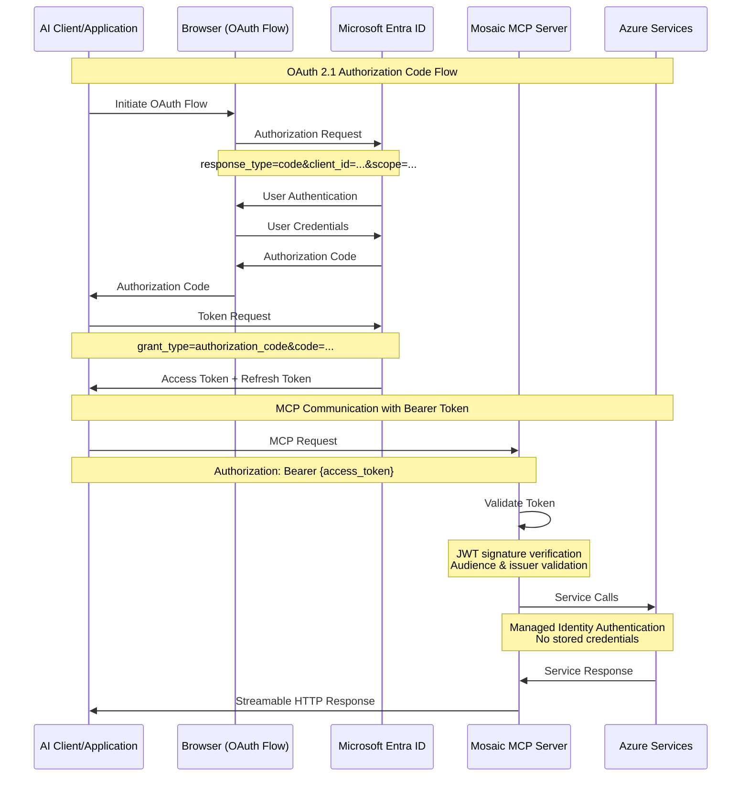

# Security and Authentication Architecture

This document details the OAuth 2.1 authentication flows and security patterns for the Mosaic MCP Tool.

## Security and Authentication Flow (FR-14)



## OAuth 2.1 Implementation

### Client Authentication Flow

The Mosaic MCP Tool implements OAuth 2.1 with PKCE (Proof Key for Code Exchange) for enhanced security:

#### 1. Authorization Request

```http
GET /oauth2/v2.0/authorize?
    client_id=12345678-1234-1234-1234-123456789012&
    response_type=code&
    redirect_uri=https://client.example.com/callback&
    scope=mosaic.search%20mosaic.memory%20mosaic.diagrams&
    state=random_state_value&
    code_challenge=CODE_CHALLENGE&
    code_challenge_method=S256
```

#### 2. Token Exchange

```http
POST /oauth2/v2.0/token
Content-Type: application/x-www-form-urlencoded

grant_type=authorization_code&
client_id=12345678-1234-1234-1234-123456789012&
code=AUTHORIZATION_CODE&
redirect_uri=https://client.example.com/callback&
code_verifier=CODE_VERIFIER
```

#### 3. Token Response

```json
{
  "access_token": "eyJ0eXAiOiJKV1QiLCJhbGciOiJSUzI1NiIs...",
  "refresh_token": "eyJ0eXAiOiJKV1QiLCJhbGciOiJSUzI1NiIs...",
  "token_type": "Bearer",
  "expires_in": 3600,
  "scope": "mosaic.search mosaic.memory mosaic.diagrams"
}
```

### OAuth 2.1 Scopes

The system implements fine-grained authorization with the following scopes:

| Scope | Description | Functions Enabled |
|-------|-------------|-------------------|
| `mosaic.search` | Access to hybrid search functionality | `hybrid_search`, `query_code_graph` |
| `mosaic.memory` | Memory read/write operations | `save_memory`, `retrieve_memory`, `clear_memory` |
| `mosaic.diagrams` | Diagram generation and retrieval | `generate_mermaid`, `get_diagram` |
| `mosaic.admin` | Administrative functions | System configuration, user management |

### Token Validation

```python
from azure.identity import DefaultAzureCredential
from fastmcp.auth import OAuthValidator

class MosaicTokenValidator(OAuthValidator):
    def __init__(self):
        self.credential = DefaultAzureCredential()
        self.tenant_id = os.getenv("AZURE_TENANT_ID")
        self.client_id = os.getenv("AZURE_CLIENT_ID")
    
    async def validate_token(self, token: str) -> dict:
        """Validate JWT token and extract claims"""
        try:
            # Decode JWT token
            decoded_token = jwt.decode(
                token,
                verify=True,
                audience=self.client_id,
                issuer=f"https://login.microsoftonline.com/{self.tenant_id}/v2.0"
            )
            
            # Validate scope
            scopes = decoded_token.get("scp", "").split()
            if not any(scope.startswith("mosaic.") for scope in scopes):
                raise ValueError("Invalid scope")
            
            return {
                "user_id": decoded_token.get("sub"),
                "scopes": scopes,
                "expires_at": decoded_token.get("exp")
            }
            
        except jwt.InvalidTokenError as e:
            raise ValueError(f"Invalid token: {e}")
```

## Managed Identity Authentication

### Azure Services Authentication

The system uses Azure Managed Identity for all Azure service authentication, eliminating the need for stored credentials:

```python
from azure.identity import DefaultAzureCredential
from azure.cosmos import CosmosClient
from azure.ai.openai import AzureOpenAI

class AzureServiceConnector:
    def __init__(self):
        self.credential = DefaultAzureCredential()
        
    def get_cosmos_client(self) -> CosmosClient:
        """Get authenticated Cosmos DB client"""
        return CosmosClient(
            url=os.getenv("AZURE_COSMOS_DB_ENDPOINT"),
            credential=self.credential
        )
    
    def get_openai_client(self) -> AzureOpenAI:
        """Get authenticated OpenAI client"""
        return AzureOpenAI(
            azure_endpoint=os.getenv("AZURE_OPENAI_ENDPOINT"),
            azure_ad_token_provider=get_bearer_token_provider(
                self.credential, 
                "https://cognitiveservices.azure.com/.default"
            )
        )
```

### Role-Based Access Control (RBAC)

The system implements least-privilege access with specific Azure roles:

| Service | Role | Permissions |
|---------|------|-------------|
| Cosmos DB | `DocumentDB Data Contributor` | Read/write access to documents and containers |
| Azure OpenAI | `OpenAI User` | Access to completions and embeddings endpoints |
| Azure ML | `ML Workspace Contributor` | Access to ML endpoints for inference |
| Redis Cache | `Redis Cache Contributor` | Read/write access to cache operations |

## Security Features

### JWT Token Security

- **Signature Verification**: RSA256 cryptographic signature validation
- **Audience Validation**: Ensures tokens are intended for Mosaic MCP Tool
- **Issuer Validation**: Validates tokens issued by Microsoft Entra ID
- **Expiration Checks**: Automatic token expiration validation
- **Replay Prevention**: State parameter prevents replay attacks

### Transport Security

- **HTTPS Only**: All communication encrypted with TLS 1.3
- **Certificate Pinning**: Validates Azure service certificates
- **HSTS Headers**: HTTP Strict Transport Security enforcement
- **CORS Configuration**: Restricted cross-origin resource sharing

### Data Protection

- **Encryption at Rest**: All data encrypted in Azure services
- **Encryption in Transit**: TLS encryption for all network communication
- **Key Management**: Azure Key Vault for secret management
- **Data Minimization**: Only necessary data collected and stored

## FastMCP Security Integration

### OAuth 2.1 Configuration

```python
from fastmcp import FastMCP
from fastmcp.auth import OAuthConfig

app = FastMCP("Mosaic MCP Tool")

oauth_config = OAuthConfig(
    provider="entra_id",
    client_id=os.getenv("AZURE_CLIENT_ID"),
    tenant_id=os.getenv("AZURE_TENANT_ID"),
    scopes=["mosaic.search", "mosaic.memory", "mosaic.diagrams"],
    redirect_uri="https://mosaic-mcp.azurecontainerapps.io/oauth/callback"
)

app.configure_oauth(oauth_config)
```

### Scope-Based Function Protection

```python
from fastmcp.auth import require_scope

@app.tool()
@require_scope("mosaic.search")
async def hybrid_search(query: str, limit: int = 10) -> List[Document]:
    """Hybrid search with scope protection"""
    # Implementation here
    pass

@app.tool()
@require_scope("mosaic.memory")
async def save_memory(session_id: str, content: str, type: str):
    """Memory save with scope protection"""
    # Implementation here
    pass
```

## Error Handling and Security

### Authentication Errors

```python
class SecurityError(Exception):
    """Base security exception"""
    pass

class InvalidTokenError(SecurityError):
    """Invalid or expired token"""
    pass

class InsufficientScopeError(SecurityError):
    """Insufficient scope for operation"""
    pass

async def handle_auth_error(error: Exception) -> dict:
    """Standardized authentication error handling"""
    if isinstance(error, InvalidTokenError):
        return {
            "error": "invalid_token",
            "error_description": "The access token is invalid or expired",
            "status_code": 401
        }
    elif isinstance(error, InsufficientScopeError):
        return {
            "error": "insufficient_scope",
            "error_description": "The request requires higher privileges",
            "status_code": 403
        }
    else:
        return {
            "error": "authentication_failed",
            "error_description": "Authentication failed",
            "status_code": 401
        }
```

### Rate Limiting and Abuse Prevention

```python
from fastmcp.middleware import RateLimiter

rate_limiter = RateLimiter(
    requests_per_minute=100,
    requests_per_hour=1000,
    burst_size=10
)

app.add_middleware(rate_limiter)
```

## Monitoring and Audit

### Security Logging

```python
import logging
from azure.monitor.opentelemetry import configure_azure_monitor

# Configure Azure Monitor for security events
configure_azure_monitor(
    connection_string=os.getenv("APPLICATIONINSIGHTS_CONNECTION_STRING")
)

security_logger = logging.getLogger("mosaic.security")

def log_security_event(event_type: str, user_id: str, details: dict):
    """Log security events for monitoring"""
    security_logger.info(
        f"Security event: {event_type}",
        extra={
            "user_id": user_id,
            "event_type": event_type,
            "details": details,
            "timestamp": datetime.utcnow().isoformat()
        }
    )
```

### Security Metrics

- **Authentication Success Rate**: Percentage of successful authentications
- **Token Validation Failures**: Failed token validation attempts
- **Scope Violations**: Attempts to access unauthorized functions
- **Rate Limit Violations**: Requests exceeding rate limits

## Compliance and Governance

### Data Residency

- **Geographic Boundaries**: Data stored in specified Azure regions
- **Cross-Border Transfers**: Controlled data movement policies
- **Regulatory Compliance**: GDPR, CCPA, and industry-specific requirements

### Audit Trail

- **Access Logs**: Complete audit trail of all access attempts
- **Change Logs**: Track all configuration and data modifications
- **Retention Policies**: Configurable log retention periods
- **Export Capabilities**: Audit log export for compliance reporting

## Related Documentation

- **[System Overview](system-overview.md)** - High-level architecture
- **[MCP Protocol Flow](mcp-protocol-flow.md)** - Communication protocols
- **[Azure Infrastructure](azure-infrastructure.md)** - Infrastructure deployment
