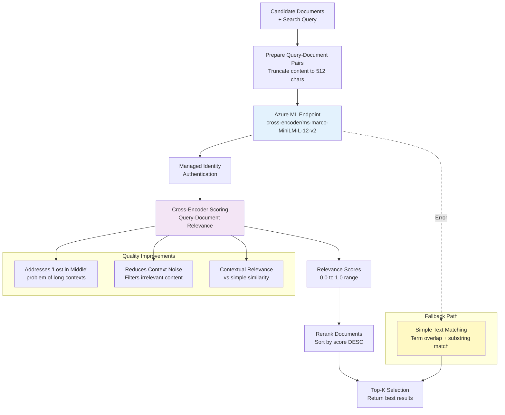

# Semantic Reranking Architecture

This document details the context refinement and semantic reranking workflows for the Mosaic MCP Tool.

## Semantic Reranking Flow (FR-8)



## Cross-Encoder vs Bi-Encoder

### Bi-Encoder Architecture

- **Separate Embeddings**: Query and document encoded independently
- **Similarity Calculation**: Cosine similarity between embeddings
- **Performance**: Fast inference, good for large-scale retrieval
- **Accuracy**: Lower precision for nuanced relevance

### Cross-Encoder Architecture

- **Joint Encoding**: Query and document processed together
- **Direct Scoring**: Model outputs relevance score directly
- **Performance**: Slower inference, better for reranking
- **Accuracy**: Higher precision for contextual relevance

## Reranking Process

### Input Preparation

```python
def prepare_reranking_input(query: str, documents: List[Document]) -> List[Dict]:
    """Prepare query-document pairs for cross-encoder scoring"""
    pairs = []
    for doc in documents:
        # Truncate content to model's token limit
        truncated_content = doc.content[:512]
        pairs.append({
            "query": query,
            "document": truncated_content,
            "doc_id": doc.id
        })
    return pairs
```

### Azure ML Endpoint Request

```json
{
  "instances": [
    {
      "query": "authentication patterns in microservices",
      "document": "OAuth 2.0 is a widely used authentication framework for microservices..."
    },
    {
      "query": "authentication patterns in microservices", 
      "document": "JWT tokens provide stateless authentication across distributed services..."
    }
  ],
  "parameters": {
    "return_scores": true,
    "batch_size": 16
  }
}
```

### Response Processing

```json
{
  "predictions": [0.92, 0.78, 0.65, 0.43, 0.21]
}
```

## RefinementPlugin Functions

### rerank(query: str, documents: List[Document], limit: int = 10)

**Purpose**: Reranks documents based on semantic relevance to query

**Implementation**:

1. **Input Validation**: Validate query and document inputs
2. **Batch Preparation**: Create query-document pairs with content truncation
3. **Model Inference**: Call Azure ML endpoint with managed identity auth
4. **Score Processing**: Extract relevance scores from model response
5. **Ranking**: Sort documents by relevance score (descending)
6. **Top-K Selection**: Return top-k most relevant documents

**Fallback Strategy**: If ML endpoint fails, use simple text matching:

```python
def fallback_scoring(query: str, document: str) -> float:
    """Simple text-based relevance scoring"""
    query_terms = set(query.lower().split())
    doc_terms = set(document.lower().split())
    
    # Jaccard similarity
    intersection = len(query_terms & doc_terms)
    union = len(query_terms | doc_terms)
    
    return intersection / union if union > 0 else 0.0
```

## Model Deployment

### Azure ML Endpoint Configuration

```python
endpoint_config = {
    "name": "mosaic-reranker-endpoint",
    "model": "cross-encoder/ms-marco-MiniLM-L-12-v2",
    "compute_type": "managed",
    "instance_type": "Standard_DS3_v2",
    "instance_count": 1,
    "authentication": "managed_identity",
    "scaling": {
        "min_instances": 0,
        "max_instances": 3,
        "target_utilization": 70
    }
}
```

### Model Performance Characteristics

- **Model Size**: 67MB (compact for efficient deployment)
- **Input Length**: 512 tokens maximum
- **Inference Time**: ~50ms per query-document pair
- **Batch Size**: 16 pairs per request (optimal throughput)
- **Throughput**: ~320 pairs/second on Standard_DS3_v2

## Quality Improvements

### Addressing "Lost in the Middle" Problem

The cross-encoder model processes query-document pairs jointly, ensuring:

- **Contextual Understanding**: Model sees full context of query-document relationship
- **Position Independence**: Relevance not affected by document position in context
- **Precision Ranking**: Documents ranked by actual relevance, not proximity

### Context Noise Reduction

- **Relevance Filtering**: Only semantically relevant documents pass through
- **Score Thresholding**: Documents below relevance threshold are filtered out
- **Content Truncation**: Focuses on most relevant content within token limits

### Semantic vs Lexical Relevance

- **Semantic Understanding**: Captures meaning beyond keyword matching
- **Contextual Relevance**: Understands domain-specific terminology
- **Intent Matching**: Aligns document content with query intent

## Performance Optimization

### Batch Processing

```python
async def batch_rerank(
    query: str, 
    documents: List[Document], 
    batch_size: int = 16
) -> List[Document]:
    """Process documents in batches for optimal throughput"""
    results = []
    
    for i in range(0, len(documents), batch_size):
        batch = documents[i:i + batch_size]
        batch_scores = await score_batch(query, batch)
        results.extend(zip(batch, batch_scores))
    
    # Sort by score and return top documents
    results.sort(key=lambda x: x[1], reverse=True)
    return [doc for doc, score in results]
```

### Caching Strategy

- **Query Caching**: Cache reranking results for identical queries
- **Model Caching**: Keep model warm to reduce cold start latency
- **Result Caching**: Cache top-k results for frequently accessed queries

### Error Handling

```python
async def robust_rerank(query: str, documents: List[Document]) -> List[Document]:
    """Reranking with fallback strategies"""
    try:
        # Primary: Azure ML endpoint
        return await ml_endpoint_rerank(query, documents)
    except MLEndpointError:
        # Fallback: Simple text matching
        return fallback_text_rerank(query, documents)
    except Exception as e:
        # Ultimate fallback: Return original order
        logger.error(f"Reranking failed: {e}")
        return documents
```

## Integration with Retrieval

### Retrieval-Reranking Pipeline

```python
async def enhanced_search(query: str, limit: int = 10) -> List[Document]:
    """Complete search pipeline with reranking"""
    
    # Stage 1: Hybrid retrieval (broader recall)
    candidates = await hybrid_search(query, limit=50)
    
    # Stage 2: Semantic reranking (precision)
    reranked = await rerank(query, candidates, limit=limit)
    
    return reranked
```

### Score Combination

When combining retrieval and reranking scores:

```python
def combine_scores(retrieval_score: float, rerank_score: float) -> float:
    """Combine retrieval and reranking scores"""
    # Weighted combination favoring reranking
    return (retrieval_score * 0.3) + (rerank_score * 0.7)
```

## Monitoring and Metrics

### Performance Metrics

- **Latency**: Average reranking time per query
- **Throughput**: Documents processed per second
- **Accuracy**: Manual evaluation of ranking quality
- **Fallback Rate**: Percentage of queries using fallback scoring

### Quality Metrics

- **Precision@K**: Relevant documents in top-k results
- **NDCG**: Normalized Discounted Cumulative Gain
- **MAP**: Mean Average Precision
- **User Satisfaction**: Click-through rates and feedback

## Related Documentation

- **[Search Retrieval](search-retrieval.md)** - Retrieval mechanisms
- **[System Overview](system-overview.md)** - High-level architecture
- **[Azure Infrastructure](azure-infrastructure.md)** - Infrastructure deployment
