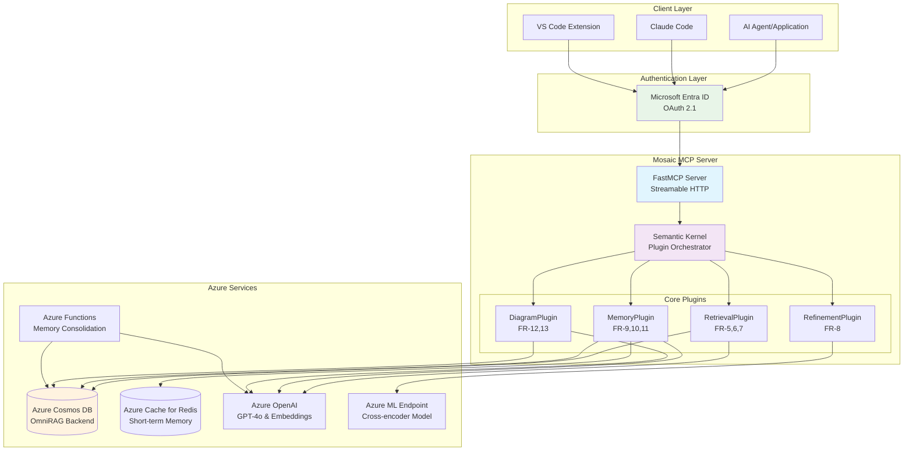

# System Overview Architecture

This document provides the high-level system architecture and component interactions for the Mosaic MCP Tool.

## System Architecture Diagram

## Key Components

### Client Layer

- **AI Agent/Application**: Various AI applications that connect via MCP protocol
- **Claude Code**: AI coding assistant integration
- **VS Code Extension**: IDE extension for developer tools

### Authentication Layer

- **Microsoft Entra ID**: OAuth 2.1 authentication provider for secure access control
- **OAuth 2.1**: Latest security standard with PKCE for secure client authentication

### Mosaic MCP Server

- **FastMCP Server**: High-performance MCP server with Streamable HTTP transport
- **Semantic Kernel**: Plugin orchestrator that manages all core functionality
- **Plugin Architecture**: Modular design following Semantic Kernel patterns

### Core Plugins

- **RetrievalPlugin**: Hybrid search and graph-based code analysis (FR-5, 6, 7)
- **RefinementPlugin**: Semantic reranking for context precision (FR-8)
- **MemoryPlugin**: Multi-layered memory management (FR-9, 10, 11)
- **DiagramPlugin**: Mermaid diagram generation and management (FR-12, 13)

### Azure Services

- **Azure Cosmos DB**: Unified OmniRAG backend for vector search, graph data, and long-term memory
- **Azure Cache for Redis**: High-speed short-term memory storage
- **Azure OpenAI**: GPT-4o for LLM operations and text-embedding-3-small for embeddings
- **Azure ML Endpoint**: Hosts cross-encoder model for semantic reranking
- **Azure Functions**: Serverless memory consolidation processing

## Architecture Principles

### OmniRAG Pattern

The system implements Microsoft's OmniRAG pattern using Azure Cosmos DB as a unified backend for:

- **Vector Search**: Semantic similarity search with embeddings
- **Graph Operations**: Code dependency analysis with embedded relationships
- **Document Storage**: Traditional text search and retrieval
- **Memory Storage**: Long-term agent memory persistence

### Microservices Architecture

- **Containerized Deployment**: Docker containers on Azure Container Apps
- **Serverless Functions**: Event-driven memory consolidation
- **Managed Services**: Azure-native services for scalability and reliability

### Security-First Design

- **OAuth 2.1 Authentication**: Modern security standards for client access
- **Managed Identity**: Credential-free authentication for Azure services
- **Zero-Trust Architecture**: Authentication required for all operations

## Related Documentation

- **[MCP Protocol Flow](mcp-protocol-flow.md)** - Detailed communication patterns
- **[Azure Infrastructure](azure-infrastructure.md)** - Infrastructure deployment architecture
- **[Plugin Interactions](plugin-interactions.md)** - Plugin system design patterns
