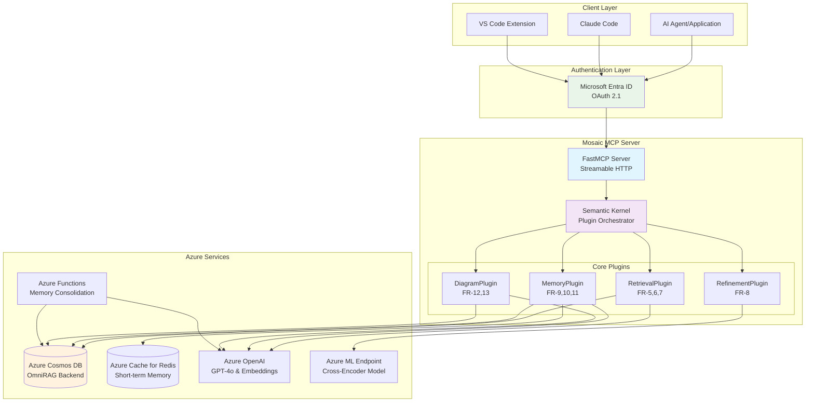
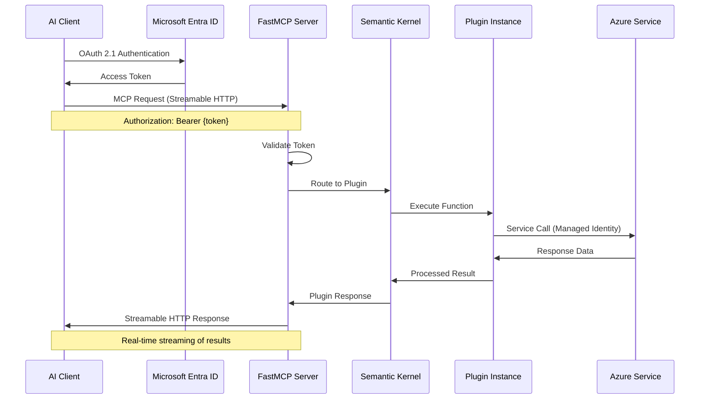
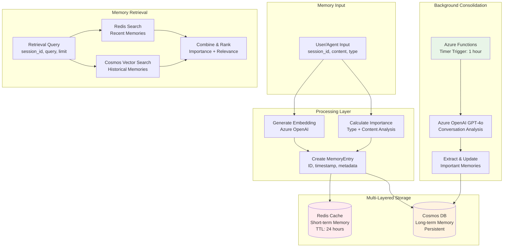
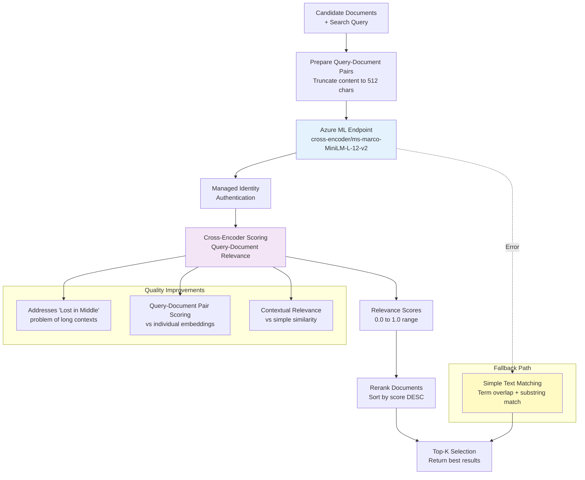
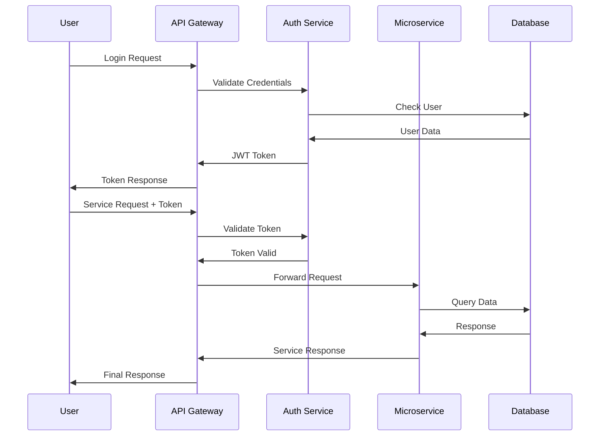
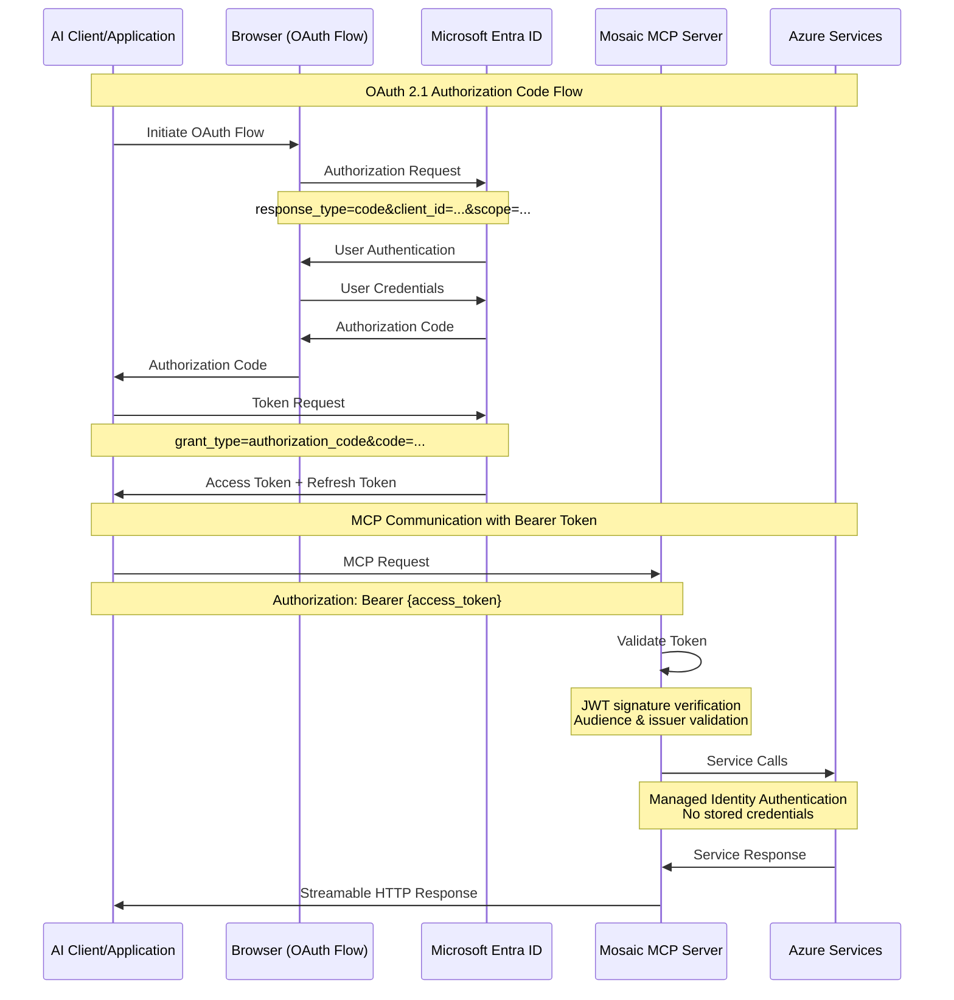
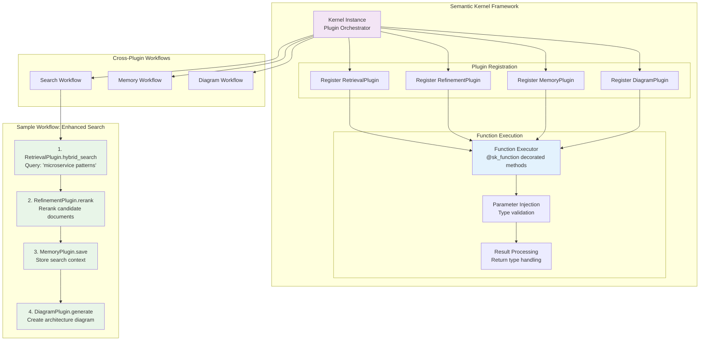

# Mosaic MCP Tool - Comprehensive Architecture Diagrams

This document provides detailed architectural diagrams explaining how the Mosaic MCP Tool operates, including state flow management, process flows, business flows, and functionality with samples.

## Table of Contents

1. [System Overview Architecture](#1-system-overview-architecture)
2. [MCP Protocol Flow](#2-mcp-protocol-flow)
3. [Hybrid Search Architecture (FR-5)](#3-hybrid-search-architecture-fr-5)
4. [OmniRAG Pattern Implementation (FR-6)](#4-omnirag-pattern-implementation-fr-6)
5. [Memory System Architecture (FR-9-11)](#5-memory-system-architecture-fr-9-11)
6. [Semantic Reranking Flow (FR-8)](#6-semantic-reranking-flow-fr-8)
7. [Diagram Generation Process (FR-12-13)](#7-diagram-generation-process-fr-12-13)
8. [Security and Authentication Flow (FR-14)](#8-security-and-authentication-flow-fr-14)
9. [Azure Infrastructure Architecture](#9-azure-infrastructure-architecture)
10. [Plugin Interaction Model](#10-plugin-interaction-model)

---

## 1. System Overview Architecture



**Key Components:**
- **Client Layer**: Various AI applications that connect via MCP protocol
- **Authentication**: OAuth 2.1 with Microsoft Entra ID for secure access
- **MCP Server**: FastMCP framework with Streamable HTTP transport
- **Plugin System**: Semantic Kernel plugins for modular functionality
- **Azure Services**: Unified backend using OmniRAG pattern

---

## 2. MCP Protocol Flow



**Process Flow:**
1. **Authentication**: Client authenticates with Entra ID using OAuth 2.1
2. **Request**: Client sends MCP request with Bearer token via Streamable HTTP
3. **Authorization**: FastMCP validates token and routes to Semantic Kernel
4. **Execution**: Kernel executes appropriate plugin function
5. **Azure Integration**: Plugin calls Azure services using managed identity
6. **Response**: Results streamed back to client in real-time

---

## 3. Hybrid Search Architecture (FR-5)

```mermaid
flowchart TD
    START([Search Query]) --> EMBEDDING[Generate Query Embedding<br/>Azure OpenAI text-embedding-3-small]
    
    EMBEDDING --> PARALLEL{Parallel Search}
    
    PARALLEL --> VECTOR[Vector Similarity Search<br/>Cosmos DB Vector Index]
    PARALLEL --> KEYWORD[Keyword Search<br/>Cosmos DB SQL Query]
    
    VECTOR --> VRESULTS[Vector Results<br/>Semantic Relevance]
    KEYWORD --> KRESULTS[Keyword Results<br/>Lexical Relevance]
    
    VRESULTS --> AGGREGATE[Aggregate & Deduplicate<br/>Combine Results by ID]
    KRESULTS --> AGGREGATE
    
    AGGREGATE --> SCORE[Score & Rank<br/>Weighted Combination]
    SCORE --> FINAL[Final Result Set<br/>List[Document]]
    
    subgraph "OmniRAG Pattern"
        COSMOS[(Unified Cosmos DB<br/>NoSQL + Vector Search)]
        VECTOR -.-> COSMOS
        KEYWORD -.-> COSMOS
    end
    
    style PARALLEL fill:#e3f2fd
    style AGGREGATE fill:#f3e5f5
    style COSMOS fill:#fff3e0
```

**Sample Query Flow:**
1. **Input**: "authentication patterns in microservices"
2. **Embedding**: Convert to 1536-dimensional vector using Azure OpenAI
3. **Vector Search**: Find semantically similar documents in Cosmos DB
4. **Keyword Search**: SQL query for documents containing "authentication", "microservices"
5. **Aggregation**: Combine and deduplicate by document ID
6. **Scoring**: Weight vector results higher, merge with keyword matches
7. **Output**: Ranked list of relevant documents

---

## 4. OmniRAG Pattern Implementation (FR-6)

```mermaid
graph TB
    subgraph "Traditional vs OmniRAG"
        direction LR
        subgraph "Traditional Architecture"
            T1[(Vector DB)]
            T2[(Graph DB)]
            T3[(Document DB)]
            T4[(Search Service)]
        end
        
        subgraph "OmniRAG Pattern"
            UNIFIED[(Unified Cosmos DB<br/>NoSQL API)]
        end
    end
    
    subgraph "Document Structure"
        DOC["{<br/>  'id': 'pypi_flask',<br/>  'libtype': 'pypi',<br/>  'libname': 'flask',<br/>  'developers': ['contact@palletsprojects.com'],<br/>  'dependency_ids': ['pypi_werkzeug', 'pypi_jinja2'],<br/>  'used_by_lib': ['pypi_flask_sqlalchemy'],<br/>  'embedding': [0.012, ..., -0.045],<br/>  'content': 'Flask is a micro web framework...'<br/>}"]
    end
    
    subgraph "Query Operations"
        Q1[Vector Search:<br/>VectorDistance(embedding, @query)]
        Q2[Keyword Search:<br/>CONTAINS(content, @term)]
        Q3[Graph Traversal:<br/>dependency_ids ARRAY operations]
        Q4[Full-Text Search:<br/>Standard SQL queries]
    end
    
    UNIFIED --> DOC
    DOC --> Q1
    DOC --> Q2
    DOC --> Q3
    DOC --> Q4
    
    style UNIFIED fill:#fff3e0
    style DOC fill:#e8f5e8
```

**Benefits of OmniRAG Pattern:**
- **Simplified Architecture**: Single database for all data types
- **Reduced Complexity**: No need for separate vector, graph, and document stores
- **Unified Queries**: Single SQL API for all operations
- **Cost Efficiency**: One service instead of multiple managed services
- **Consistent Performance**: Single connection pool and optimization

**Sample Graph Query:**
```sql
-- Find all dependencies of Flask
SELECT c.libname, c.dependency_ids 
FROM c 
WHERE c.id = 'pypi_flask'

-- Find all libraries that depend on Flask
SELECT c.libname 
FROM c 
WHERE ARRAY_CONTAINS(c.dependency_ids, 'pypi_flask')
```

---

## 5. Memory System Architecture (FR-9-11)



**Memory Types & Importance Scoring:**
- **Episodic** (0.6): Specific events and interactions
- **Semantic** (0.8): General knowledge and facts  
- **Procedural** (0.7): How-to instructions and processes

**Consolidation Process:**
1. **Timer Trigger**: Every hour, Azure Function analyzes recent memories
2. **LLM Analysis**: GPT-4o identifies patterns and important information
3. **Knowledge Extraction**: Extract key facts and update long-term memory
4. **Redundancy Removal**: Merge similar memories to prevent duplication

**Sample Memory Entry:**
```json
{
  "id": "mem_abc123",
  "sessionId": "user_session_xyz",
  "type": "semantic",
  "content": "User prefers using TypeScript for new projects",
  "embedding": [0.012, ..., -0.045],
  "importanceScore": 0.85,
  "timestamp": "2025-07-14T10:30:00Z",
  "metadata": {
    "source": "conversation_summary",
    "consolidation_run": "2025-07-14T11:00:00Z"
  }
}
```

---

## 6. Semantic Reranking Flow (FR-8)



**Cross-Encoder vs Bi-Encoder:**
- **Bi-Encoder**: Separate embeddings for query and document, cosine similarity
- **Cross-Encoder**: Joint encoding of query+document pairs, direct relevance score
- **Performance**: Cross-encoder provides better relevance but slower inference

**Sample Reranking Request:**
```json
{
  "instances": [
    {
      "query": "implement authentication in FastAPI",
      "document": "FastAPI provides built-in OAuth2 support...",
      "doc_id": "doc_123"
    }
  ],
  "parameters": {
    "return_scores": true,
    "batch_size": 16
  }
}
```

**Response:**
```json
{
  "predictions": [0.92, 0.78, 0.65, 0.43]
}
```

---

## 7. Diagram Generation Process (FR-12-13)

```mermaid
stateDiagram-v2
    [*] --> InputReceived: Natural Language Description
    
    InputReceived --> TypeDetection: Analyze Description
    
    TypeDetection --> FlowChart: "process", "workflow", "steps"
    TypeDetection --> Sequence: "interaction", "communication", "API"
    TypeDetection --> Class: "object", "inheritance", "relationship"
    TypeDetection --> ER: "database", "table", "schema"
    TypeDetection --> Journey: "user journey", "experience"
    TypeDetection --> Gantt: "timeline", "project", "schedule"
    
    FlowChart --> PromptGeneration: Create Specific Prompt
    Sequence --> PromptGeneration
    Class --> PromptGeneration
    ER --> PromptGeneration
    Journey --> PromptGeneration
    Gantt --> PromptGeneration
    
    PromptGeneration --> LLMCall: Azure OpenAI GPT-4o
    LLMCall --> SyntaxCleaning: Remove markdown, validate
    
    SyntaxCleaning --> Validation: Check diagram syntax
    Validation --> Storage: Store in Cosmos DB
    Storage --> ResourceRegistration: Register as MCP Resource
    
    ResourceRegistration --> [*]: Return Mermaid Syntax
    
    Validation --> Fallback: Invalid syntax
    Fallback --> [*]: Return simple diagram
```

**Diagram Type Detection Logic:**
```python
type_indicators = {
    "flowchart": ["process", "workflow", "step", "decision", "algorithm"],
    "sequenceDiagram": ["interaction", "communication", "API", "request", "response"],
    "classDiagram": ["class", "object", "inheritance", "relationship"],
    "erDiagram": ["database", "table", "entity", "schema", "foreign key"],
    "journey": ["user journey", "experience", "touchpoint"],
    "gantt": ["timeline", "schedule", "project", "milestone"]
}
```

**Sample Prompt Template:**
```
You are an expert at creating Mermaid diagrams from natural language descriptions.

Given: "User authentication flow in a microservice architecture"
Detected Type: sequenceDiagram

Generate ONLY the Mermaid syntax - no explanations:
```

**Generated Output:**


---

## 8. Security and Authentication Flow (FR-14)



**Security Features:**
- **OAuth 2.1 Compliance**: Latest security standard with PKCE
- **Managed Identity**: No stored credentials for Azure services
- **JWT Validation**: Cryptographic signature verification
- **Scope-based Access**: Fine-grained permission control
- **Token Refresh**: Automatic token renewal for long-running sessions

**OAuth 2.1 Scopes:**
- `mosaic.search`: Access to hybrid search functionality
- `mosaic.memory`: Memory read/write operations
- `mosaic.diagrams`: Diagram generation and retrieval
- `mosaic.admin`: Administrative functions

---

## 9. Azure Infrastructure Architecture

```mermaid
graph TB
    subgraph "Azure Subscription"
        subgraph "Resource Group: rg-mosaic-dev"
            subgraph "Compute Services"
                ACA[Azure Container Apps<br/>Consumption Plan<br/>Auto-scaling 0-10 replicas]
                FUNC[Azure Functions<br/>Consumption Plan<br/>Timer Trigger: Memory Consolidation]
            end
            
            subgraph "Data Services"
                COSMOS[Azure Cosmos DB for NoSQL<br/>Serverless (1000 RU/s)<br/>OmniRAG Pattern]
                REDIS[Azure Cache for Redis<br/>Basic C0 (250MB)<br/>Short-term Memory]
            end
            
            subgraph "AI Services"
                AOAI[Azure OpenAI Service<br/>GPT-4o (2024-11-20)<br/>text-embedding-3-small]
                ML[Azure ML Workspace<br/>cross-encoder endpoint]
            end
            
            subgraph "Supporting Services"
                ACR[Azure Container Registry<br/>Docker image storage]
                KV[Azure Key Vault<br/>Secrets management]
                SA[Storage Account<br/>Function app storage]
                AI[AI Foundry Hub<br/>Model management]
            end
            
            subgraph "Identity & Security"
                MI[Managed Identity<br/>System-assigned]
                ENTRA[Microsoft Entra ID<br/>OAuth 2.1 provider]
            end
        end
    end
    
    subgraph "External Clients"
        CLIENT[AI Applications<br/>Claude Code, VS Code, etc.]
    end
    
    CLIENT --> ENTRA
    ENTRA --> ACA
    ACA --> COSMOS
    ACA --> REDIS
    ACA --> AOAI
    ACA --> ML
    FUNC --> COSMOS
    FUNC --> AOAI
    
    MI --> COSMOS
    MI --> REDIS
    MI --> AOAI
    MI --> ML
    
    ACA --> ACR
    FUNC --> SA
    
    style ACA fill:#e3f2fd
    style COSMOS fill:#fff3e0
    style AOAI fill:#f3e5f5
    style ENTRA fill:#e8f5e8
```

**Cost Optimization (POC SKUs):**
- **Container Apps**: Consumption plan scales to zero when idle
- **Cosmos DB**: Serverless billing only for actual usage
- **Redis**: Basic C0 tier for development workloads
- **Functions**: Consumption plan with generous free tier
- **OpenAI**: Pay-per-use with no reserved capacity

**Deployment Process:**
```bash
# Single command deployment
azd up

# Individual service deployment
azd deploy

# Environment management
azd env get-values
azd env set AZURE_OPENAI_ENDPOINT "https://..."
```

---

## 10. Plugin Interaction Model



**Plugin Interaction Patterns:**

1. **Sequential Execution**: Output of one plugin becomes input to another
2. **Parallel Execution**: Multiple plugins execute simultaneously
3. **Conditional Execution**: Plugin execution based on previous results
4. **Event-Driven**: Plugins react to events from other plugins

**Sample Cross-Plugin Workflow:**
```python
# Enhanced search with memory and visualization
async def enhanced_search(query: str, session_id: str):
    # 1. Hybrid search
    documents = await retrieval_plugin.hybrid_search(query)
    
    # 2. Semantic reranking
    ranked_docs = await refinement_plugin.rerank(query, documents)
    
    # 3. Save search context to memory
    search_context = f"Searched for: {query}, found {len(ranked_docs)} results"
    await memory_plugin.save(session_id, search_context, "episodic")
    
    # 4. Generate architecture diagram if relevant
    if "architecture" in query.lower():
        diagram = await diagram_plugin.generate(f"Architecture diagram for {query}")
        return {"documents": ranked_docs, "diagram": diagram}
    
    return {"documents": ranked_docs}
```

---

## Summary

The Mosaic MCP Tool implements a sophisticated, production-ready architecture that addresses all 14 functional requirements through:

1. **Unified OmniRAG Pattern**: Single Cosmos DB backend for all data operations
2. **Multi-Layered Memory**: Redis + Cosmos DB with LLM-powered consolidation
3. **Advanced Reranking**: Cross-encoder model for precise relevance scoring
4. **Real-time Communication**: Streamable HTTP with OAuth 2.1 security
5. **Serverless Architecture**: Cost-optimized Azure services with auto-scaling
6. **Plugin Modularity**: Semantic Kernel framework for extensible functionality

The system is designed for high performance, scalability, and maintainability while providing a standardized MCP interface for AI applications to access advanced context engineering capabilities.