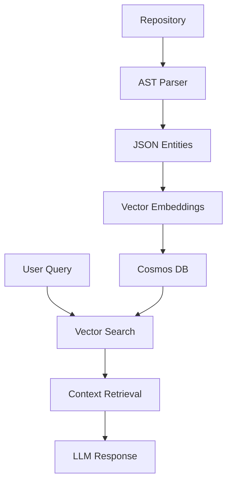
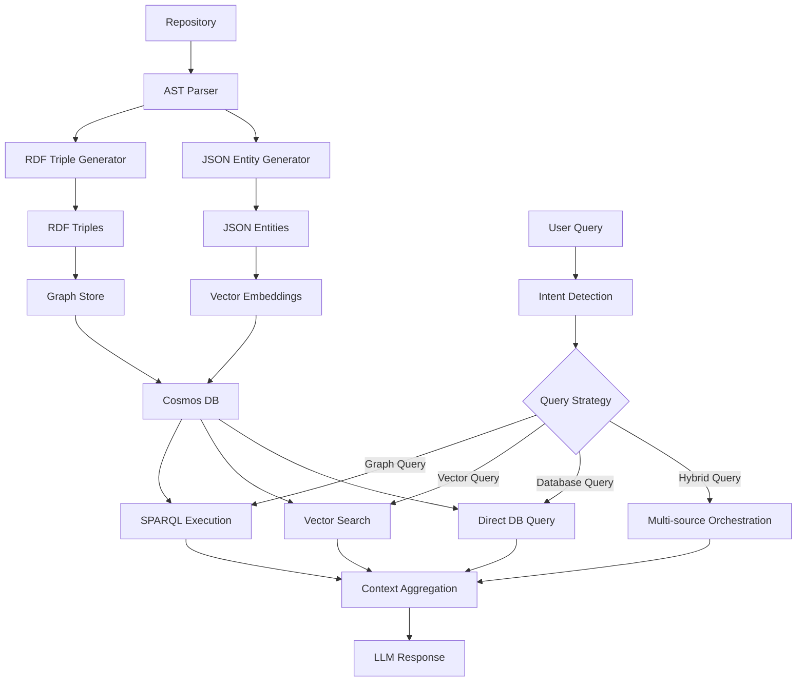

# Architecture Transformation: From Basic RAG to OmniRAG

## 🎯 Transformation Overview

This document outlines the complete architectural transformation from our current Basic RAG implementation to the advanced OmniRAG pattern based on CosmosAIGraph reference architecture.

## 🏗️ Current vs Target Architecture

### Current Architecture (Basic RAG)



### Target Architecture (OmniRAG)



## 🔄 Service Transformation Details

### Mosaic Ingestion Service Transformation

#### Current Structure:

```python
src/mosaic-ingestion/
├── main.py                    # Entry point
├── plugins/
│   ├── ingestion.py          # Repository processing
│   ├── ai_code_parser.py     # AST parsing
│   └── ai_error_handler.py   # Error handling
```

#### Target Structure:

```python
src/mosaic-ingestion/
├── main.py                    # Enhanced entry point
├── plugins/
│   ├── ingestion.py          # Repository processing (ENHANCED)
│   ├── ai_code_parser.py     # AST parsing (ENHANCED)
│   └── ai_error_handler.py   # Error handling
├── rdf/                       # NEW: RDF Processing Layer
│   ├── __init__.py
│   ├── ontology_manager.py   # Load and manage OWL ontologies
│   ├── triple_generator.py   # Convert AST to RDF triples
│   ├── graph_builder.py      # Build in-memory RDF graphs
│   └── sparql_builder.py     # Generate SPARQL queries
├── ontologies/                # NEW: Domain Ontologies
│   ├── code_base.owl         # Base code entity ontology
│   ├── python.owl            # Python-specific extensions
│   ├── javascript.owl        # JavaScript-specific extensions
│   ├── dependencies.owl      # Library dependency ontology
│   └── relationships.owl     # Code relationship ontology
├── schemas/                   # NEW: Enhanced Schemas
│   ├── rdf_triple_schema.py  # RDF triple data structures
│   ├── graph_schema.py       # Graph relationship schemas
│   └── hybrid_schema.py      # Combined vector + graph schemas
```

### Mosaic Query Server Transformation

#### Current Structure:

```python
src/mosaic-mcp/
├── server/main.py            # FastMCP server
├── plugins/
│   ├── retrieval_plugin.py   # Vector search only
│   ├── refinement_plugin.py  # Result reranking
│   ├── memory_plugin.py      # Memory management
│   └── diagram_plugin.py     # Mermaid generation
```

#### Target Structure:

```python
src/mosaic-mcp/
├── server/main.py            # FastMCP server (ENHANCED)
├── plugins/
│   ├── retrieval_plugin.py   # Vector search (ENHANCED)
│   ├── refinement_plugin.py  # Result reranking
│   ├── memory_plugin.py      # Memory management
│   ├── diagram_plugin.py     # Mermaid generation (ENHANCED)
│   ├── graph_plugin.py       # NEW: SPARQL query execution
│   ├── intent_plugin.py      # NEW: Query intent detection
│   └── omnirag_plugin.py     # NEW: Multi-source orchestration
├── sparql/                    # NEW: SPARQL Processing
│   ├── __init__.py
│   ├── query_executor.py     # Execute SPARQL queries
│   ├── nl2sparql.py          # Natural language to SPARQL
│   └── result_formatter.py   # Format SPARQL results
├── intent/                    # NEW: Intent Detection
│   ├── __init__.py
│   ├── classifier.py         # Classify query intent
│   ├── strategy_router.py    # Route to appropriate strategy
│   └── confidence_scorer.py  # Score intent predictions
```

## 📊 Data Schema Evolution

### Current Cosmos DB Schema

```json
{
  "id": "entity_md5_hash",
  "type": "code_entity",
  "entity_type": "function | class | module | import",
  "name": "function_name",
  "language": "python",
  "file_path": "/path/to/file.py",
  "content": "def example():\n    pass",
  "embedding": [0.012, -0.045, ...],
  "timestamp": "2025-01-21T12:05:00Z"
}
```

### Target OmniRAG Schema

```json
{
  "id": "entity_md5_hash",
  "type": "code_entity",
  "entity_type": "function | class | module | import",
  "name": "function_name",
  "language": "python",
  "file_path": "/path/to/file.py",
  "content": "def example():\n    pass",
  "embedding": [0.012, -0.045, ...],
  "timestamp": "2025-01-21T12:05:00Z",

  // NEW: RDF Integration
  "rdf_triples": [
    {
      "subject": "file://path/to/file.py#example",
      "predicate": "http://www.w3.org/1999/02/22-rdf-syntax-ns#type",
      "object": "http://mosaic.ai/code#Function"
    },
    {
      "subject": "file://path/to/file.py#example",
      "predicate": "http://mosaic.ai/code#definedIn",
      "object": "file://path/to/file.py"
    }
  ],

  // NEW: Graph Relationships
  "relationships": [
    {
      "type": "calls",
      "target": "entity_id_2",
      "metadata": {"line_number": 42}
    },
    {
      "type": "imports",
      "target": "library_flask",
      "metadata": {"import_type": "from_import"}
    }
  ],

  // NEW: SPARQL Indexing
  "sparql_indexed": true,
  "ontology_classes": ["code:Function", "code:PublicMethod"],
  "graph_context": "repository_main_branch"
}
```

## 🧠 Intent Detection Strategy

### Query Classification System

```python
class QueryIntentClassifier:
    """
    Classifies queries into optimal retrieval strategies
    """

    INTENT_PATTERNS = {
        "graph_traversal": [
            "dependencies", "depends on", "hierarchy", "inheritance",
            "calls", "references", "imports", "extends", "implements"
        ],
        "vector_similarity": [
            "similar", "like", "related", "comparable", "equivalent",
            "find functions", "search for", "examples of"
        ],
        "database_lookup": [
            "details", "information", "description", "definition",
            "what is", "tell me about", "show me"
        ],
        "hybrid_multi_source": [
            "comprehensive", "complete", "full context", "everything about",
            "analyze", "explain thoroughly"
        ]
    }
```

### Strategy Routing Logic

```python
def route_query(query: str, confidence_threshold: float = 0.7) -> QueryStrategy:
    """
    Routes queries to optimal retrieval strategy
    """
    intent_scores = intent_classifier.predict(query)

    if intent_scores["graph_traversal"] > confidence_threshold:
        return GraphRAGStrategy()
    elif intent_scores["vector_similarity"] > confidence_threshold:
        return VectorRAGStrategy()
    elif intent_scores["database_lookup"] > confidence_threshold:
        return DatabaseRAGStrategy()
    else:
        return HybridRAGStrategy()
```

## 🔍 SPARQL Query Generation

### Natural Language to SPARQL Examples

#### Query: "What are the dependencies of Flask?"

```sparql
PREFIX code: <http://mosaic.ai/code#>
PREFIX rdfs: <http://www.w3.org/2000/01/rdf-schema#>

SELECT ?dependency ?dependencyName
WHERE {
    ?flask rdfs:label "Flask" .
    ?flask code:dependsOn ?dependency .
    ?dependency rdfs:label ?dependencyName .
}
```

#### Query: "Show me all functions that call database operations"

```sparql
PREFIX code: <http://mosaic.ai/code#>

SELECT ?function ?functionName ?dbOperation
WHERE {
    ?function a code:Function .
    ?function rdfs:label ?functionName .
    ?function code:calls ?dbOperation .
    ?dbOperation code:hasCategory "database" .
}
```

#### Query: "What is the inheritance hierarchy for Exception classes?"

```sparql
PREFIX code: <http://mosaic.ai/code#>

SELECT ?class ?parent ?level
WHERE {
    ?class a code:Class .
    ?class code:inheritsFrom+ ?parent .
    ?parent rdfs:label ?parentName .
    FILTER(CONTAINS(LCASE(?parentName), "exception"))
}
ORDER BY ?level
```

## 🏪 Multi-Source Context Orchestration

### Orchestration Strategy

```python
class OmniRAGOrchestrator:
    """
    Orchestrates multiple retrieval sources for comprehensive context
    """

    async def orchestrate_context(self, query: str, intent: QueryIntent) -> Context:
        """
        Parallel execution of multiple retrieval strategies
        """
        tasks = []

        if intent.requires_graph:
            tasks.append(self.graph_plugin.query(intent.sparql_query))

        if intent.requires_vector:
            tasks.append(self.vector_plugin.search(intent.vector_query))

        if intent.requires_database:
            tasks.append(self.db_plugin.lookup(intent.db_query))

        results = await asyncio.gather(*tasks)

        return self.context_aggregator.combine(results)
```

### Context Aggregation Logic

```python
def aggregate_context(self, graph_results, vector_results, db_results) -> str:
    """
    Intelligently combines multi-source results
    """
    context_sections = []

    # Graph results provide structural relationships
    if graph_results:
        context_sections.append(f"Relationships: {self.format_graph_results(graph_results)}")

    # Vector results provide similar/related content
    if vector_results:
        context_sections.append(f"Related Code: {self.format_vector_results(vector_results)}")

    # Database results provide detailed information
    if db_results:
        context_sections.append(f"Details: {self.format_db_results(db_results)}")

    return "\n\n".join(context_sections)
```

## 📦 New Dependencies Required

### Python Packages for Ingestion Service

```bash
# RDF and SPARQL processing
pip install rdflib==7.1.1
pip install SPARQLWrapper==2.0.0
pip install owlready2==0.46

# Graph processing
pip install networkx==3.2.1
pip install python-igraph==0.11.4

# Enhanced NLP for intent detection
pip install transformers==4.36.2
pip install sentence-transformers==2.2.2
```

### Python Packages for Query Server

```bash
# Same RDF dependencies
pip install rdflib==7.1.1
pip install SPARQLWrapper==2.0.0

# Intent classification
pip install scikit-learn==1.3.2
pip install torch==2.1.2
```

## 🔧 Configuration Changes

### Enhanced Environment Variables

```bash
# Existing variables (unchanged)
AZURE_OPENAI_ENDPOINT=https://your-openai.openai.azure.com/
AZURE_COSMOS_DB_ENDPOINT=https://your-cosmos.documents.azure.com:443/

# NEW: RDF and Graph Configuration
MOSAIC_ONTOLOGY_BASE_URL=http://mosaic.ai/ontology/
MOSAIC_GRAPH_NAMESPACE=http://mosaic.ai/code#
MOSAIC_RDF_STORE_TYPE=memory  # or persistent
MOSAIC_SPARQL_ENDPOINT_ENABLED=true

# NEW: Intent Detection Configuration
MOSAIC_INTENT_MODEL_PATH=./models/intent_classifier
MOSAIC_INTENT_CONFIDENCE_THRESHOLD=0.7
MOSAIC_MULTI_SOURCE_ENABLED=true

# NEW: Performance Configuration
MOSAIC_GRAPH_CACHE_SIZE=10000
MOSAIC_SPARQL_TIMEOUT_MS=5000
MOSAIC_PARALLEL_RETRIEVAL_ENABLED=true
```

### Updated Azure Container Apps Configuration

```yaml
# infra/query-server.bicep (additions)
env: [
  {
    name: 'MOSAIC_ONTOLOGY_BASE_URL'
    value: 'http://mosaic.ai/ontology/'
  }
  {
    name: 'MOSAIC_SPARQL_ENDPOINT_ENABLED'
    value: 'true'
  }
  {
    name: 'MOSAIC_MULTI_SOURCE_ENABLED'
    value: 'true'
  }
]

# Additional CPU/Memory for graph processing
resources: {
  cpu: '0.5'      # Increased from 0.25
  memory: '1.0Gi' # Increased from 0.5Gi
}
```

## 🧪 Testing Strategy Evolution

### Current Testing (Basic RAG)

- Vector search accuracy
- Embedding generation
- Basic retrieval functionality

### Enhanced Testing (OmniRAG)

- **RDF Triple Generation**: Verify AST → RDF conversion accuracy
- **SPARQL Query Execution**: Test graph traversal queries
- **Intent Classification**: Validate query routing decisions
- **Multi-source Orchestration**: Test parallel retrieval coordination
- **Context Aggregation**: Verify multi-source result combination
- **Performance Benchmarks**: Graph vs Vector vs Database query speeds

## 📋 Migration Considerations

### Backward Compatibility

- Maintain existing MCP interface contracts
- Support gradual migration of queries
- Preserve existing vector search functionality
- Ensure existing embeddings remain valid

### Data Migration

- **Phase 1**: Add RDF triples alongside existing entities
- **Phase 2**: Populate historical RDF triples for existing entities
- **Phase 3**: Enable multi-source queries
- **Phase 4**: Optimize based on usage patterns

### Performance Impact

- **Initial**: Slower ingestion due to RDF triple generation
- **Ongoing**: Faster complex queries due to graph optimization
- **Memory**: Increased memory usage for in-memory RDF graphs
- **Storage**: Additional storage for RDF triples (~30% increase estimated)

## 🎯 Success Metrics

### Functional Metrics

- **Query Coverage**: Ability to answer relationship queries
- **Response Accuracy**: Improved context relevance scores
- **Query Complexity**: Support for multi-hop graph traversals
- **Source Utilization**: Percentage of queries using optimal strategy

### Performance Metrics

- **Response Time**: Sub-100ms for graph queries
- **Throughput**: 100+ concurrent OmniRAG requests
- **Context Quality**: Measured by LLM response relevance
- **Resource Efficiency**: CPU/memory usage per query type

---

**Next Document**: `03-implementation-phases/phase-1-rdf-infrastructure.md` - Detailed Phase 1 implementation guide.
